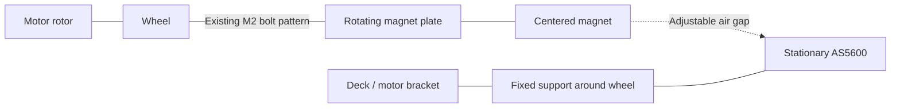

# Encoder retention: replace the bore plug

2026-09-12. Several original rigid-fit holders fell out; deeper insertion added
friction. **The owner now confirms free rotation returns with the holder removed.**
The old bare-stem designs remain retired, and the exact contact point is unknown.

The tape-wrap trial subsequently entered the bore but wobbled and needed more
reach. It is retired. At the owner's request, evaluate a [metal rod in the
existing encoder position](ENCODER_METAL_ROD.md) before changing the wheel mount.
The owner now reports a 3.4 mm motor bore; fit verification and straight support
depth remain unknown. The outside-wheel concept below is a fallback, not a
released replacement.

The existing CAD has a 3.6 mm neck passing through a stationary 4.6 mm bracket
opening: only 0.5 mm nominal radial clearance. Tilt or runout can use up that
clearance. Contact inside the motor, axial loading or contact at the sensor
are other possibilities; none is established by the reported symptoms alone.
A sliding printed pin without a retained connection cannot be treated as a
qualified rotor coupling. Increasing its length corrected a gap assumption,
but did not solve retention.

## Outside-wheel alternative

Use the wheel's existing **M2 connection to the rotating motor face** to bolt
on a small magnet plate. Center the existing 4 × 2 mm magnet on the wheel axis,
on the outside face. Relocate the AS5600 to a stationary bracket attached to
the deck/motor bracket, reaching around the wheel with tire clearance.

This is an attachment concept, not a dimensioned assembly. Fasteners retain
the plate; a positive locating feature must center it on the measured hub
geometry. The magnet needs its own shallow pocket and retention. The sensor
support must resist deflection, clear the tire and hold an adjustable air gap.
Do not infer alignment from loose clearance bolts alone.

The AS5600 senses a rotating magnetic field with the magnet centered near the
chip. That permits this proposed outboard arrangement in principle; it does
not validate the supplied magnet, nearby metal, gap or powered-motor accuracy.
[AS5600 placement guide](https://learn.adafruit.com/adafruit-as5600-magnetic-angle-sensor?view=all)

Known constraints and unresolved details:

- The current wheel envelope is 244 mm across. A 275 mm limit leaves **15.5 mm
  per side**, including magnet plate, gap, PCB, fasteners, support and headers.
  Outboard placement must fit this allowance before selection is final.
- Wheel-to-motor bolt count, spacing, head access, wheel-face recess and seating
  surface are not established. The motor's stationary 8.5 mm hole pitch is a
  different interface and must not be substituted.
- If the plate shares wheel bolts, choose their lengths from the actual plate,
  wheel and thread stack. Preserve suitable motor thread engagement and avoid
  screw intrusion. No longer bolts are selected for purchase yet.
- Keep support loads on the stationary structure. Do not use a through-motor
  screw to clamp wheel, bearing races and sensor support together.

Reuse the existing motors, wheels, magnets and AS5600s. Candidate new parts are
two printed magnet plates and two fixed sensor supports, plus appropriate M2
fasteners if the existing lengths are unsuitable. The sensor mounting hardware
can be reused if it fits the new stack. No new sensors, shafts or bearings are
selected for purchase. Cost and fit remain pending interface dimensions.

## Questions saved for the next design step

**Answered:** the wheel spins freely with the holder removed.

**Current:** 3.4 mm is established as the nominal bore size by the owner and
matching supplier listing. Check rod fit and straight support length;
see [metal-rod notes](ENCODER_METAL_ROD.md).

**Deferred for the bolted alternative:** wheel-to-motor M2 bolt head access,
count, opposite-hole spacing and wheel center-hole access. Seating/centering
geometry and the support envelope would also need checking.
