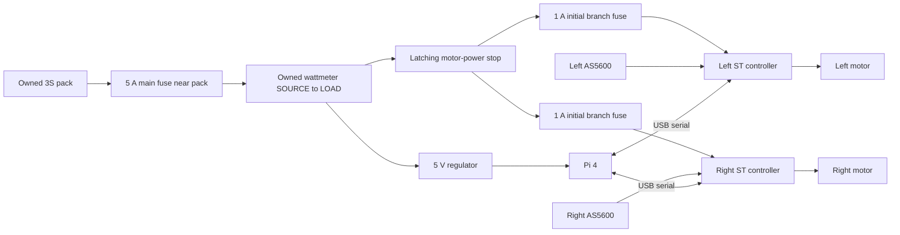

# Rolling drive rig

**2026-09-12 status: optional experiment.** The owner has asked to design around
documented, suitable components instead of qualifying uncertain owned parts.
See the [ground robot recommendation](../../../docs/GROUND_COMPONENT_RECOMMENDATION.md).
The rig, prints, metal-rod discussion and purchased controllers are retained;
the preparation steps below are not the main robot's next milestone.

This experiment uses **two owned BDUAV 2204-260KV motors, their directly attached
60 × 8 mm wheels, the owned ball caster, Pi 4 and 3S battery**. Add secured ballast
and measure travel time over a known distance. It is a ground-drive experiment;
EDF testing and whole-robot lift remain deferred.

The design is an **unpowered fit prototype**. CAD and recording tools exist;
closed-loop motor firmware and powered commissioning are still to do. Neither
the conflicting ML2206B sheet nor the controller's high-current rating supplies
a safe current setting for these motors. No powered drive-performance results exist.

**2026-09-12: the tape-wrap holder fits into the bore but wobbles and lacks
reach.** The owner proposes a metal rod in the now-reported 3.4 mm motor bore.
See [the metal-rod review](ENCODER_METAL_ROD.md) for fit, retention and magnetic
material considerations. No new print or rod cut length is released; keep the
existing encoder location while this is checked.

**Two B-G431B-ESC1 controllers are purchased and awaiting delivery**, as reported
2026-09-06. Follow [preparation before arrival](PREPARATION.md) for the immediate
print/measurement work and [USB-only diagnostics](firmware/README.md) for the
first controller checks. The diagnostic program does not drive the motors.

## Review and first print

- [Layout and interactive course calculator](output/drive_rig.html)
- [Complete hardware proposal and cost](HARDWARE.md), [editable BOM](hardware.csv)
- [Wheel-controller shopping criteria](../../../docs/DRIVE_CONTROLLER_REQUIREMENTS.md)
- [Controller alternatives and full-cost implications](../../../docs/DRIVE_CONTROLLER_OPTIONS.md)
  — retained for reference; the rig now uses the purchased ST controllers with
  the received external AS5600 encoders.
- [Assembly STEP](output/drive_rig_assembly.step), [FreeCAD assembly](output/drive_rig_assembly.FCStd)
- **One full 8.50 mm bracket now has a mounted motor that spins freely**, per
  the owner. The second bracket was last reported printing with support disabled;
  its completed quality and fit remain to check. **One caster riser is printed
  and mounted**, reported 2026-09-07; only one is needed.
  **HiLetgo board dimensions confirmed:** the received 23 × 23 mm board has
  16 × 16 mm hole centers, 4 mm holes and a centered chip, owner-confirmed.
  The [existing carrier](output/encoder_carrier_hiletgo_16mm.stl) and
  [mounting reference](ENCODER_MOUNT.md) record its inboard attachment. Hold
  duplicate encoder prints while retention is redesigned. The deck is printed;
  its geometry and the motor brackets are unchanged. See
  [preparation](PREPARATION.md) for the sequence and remaining physical checks.
- [Intended bracket shape in printing orientation](output/motor_bracket_8p50mm_preview.svg)
  — includes the reinforcing ribs and bolt-access cutouts; slicer-generated
  support/brim is not represented in the CAD model.

The deck is 220 × 240 mm. Wheel outside-to-outside width is 244 mm, track is
236 mm, axle height is 30 mm, and axle-to-caster contact spacing is 145 mm.
Ballast tray rim height is 110 mm. Reserve up to 150 mm total for secured
ballast/meter, Pi cooling and wiring. These are rig dimensions, not a new robot
module interface or a certified load rating.

## Printable parts

| Part | Quantity | Notes |
|---|---:|---|
| [Deck](output/deck.stl) | 1 | Flat underside on bed; ribs up; 220 × 240 × 12 mm |
| [Motor bracket, 8.50 mm pitch](output/motor_bracket_8p50mm.stl) | 2 | One motor mounted and spins freely; second bracket printing; generic motor_bracket.stl is also updated |
| [HiLetgo encoder carrier, 16 mm pitch](output/encoder_carrier_hiletgo_16mm.stl) | Reference | Existing inboard support; hold duplicate prints pending retention redesign |
| [Magnet stem fit gauges](output/magnet_stem_fit_gauges.stl) | Reference | 3.6 mm gauge fit, but full holder failed; no repeat gauge print requested |
| [Retired tape-wrap magnet carrier](output/magnet_carrier_tape_trial_2p8mm.stl) | History | Enters bore but wobbles and lacks reach; do not print/use |
| [Retired magnet carrier, 3.4 mm tip, neck +2.5 mm](output/magnet_carrier_4x2mm_stem_3p4mm_plus2p5mm.stl) | History | Failed retention and added drag; do not print/use this rigid-fit variant |
| [Caster riser](output/caster_riser.stl) | 1 | Printed and mounted, owner-reported 2026-09-07; rear support for the two-wheel/one-caster chassis |
| [Ballast tray](output/ballast_tray.stl) | 1 | Separate load shelf; protects the battery from ballast pressure |
| [Tray column](output/tray_column.stl) | 4 | Through-bolted, not self-tapped |
| [Electronics carrier](output/electronics_carrier.stl) | 2 | Generic insulated board support; verify actual board-edge clearance |

STLs are already oriented with their proposed bed face at Z=0. Use PETG for the
rig; a PLA coupon is fine. Start with 0.2 mm layers, 5 perimeters, 6 top/bottom
layers and 40% infill; use solid columns. These settings
are a starting point, not strength certification. The caster riser has internal
bridges in its side orientation: inspect the slicer's bridges and add local
support where needed.
Clean printed holes by hand and check that no screw rubs the rotating assembly.
The clip-like feature on the first bracket was identified by the owner as Cura
support. Support is disabled for their second bracket print; this is not yet a
completed support-free print result. Evaluate support separately for the riser
and other parts using the orientations and bridge notes above.

The [geometry report](output/geometry_report.json) checks closed meshes, single
solids, print extents and modeled assembly overlaps. It does not model every
wire, connector, screw head or board component. Solid CAD volume is **not** a
measured or slicer-estimated print mass. Weigh finished prints and hardware.

## Assembly

1. Print and check one updated 8.50 mm motor bracket, then the second identical
   part. Bolt the wheels to the rotating motor faces with
   their existing compatible M2 hardware. Wheel screw length depends on the
   actual material beneath the screw head; the full 8 mm tire width does not
   establish that stack. Keep screw tips clear of the motor internals.
2. Bolt each motor's stationary face to a printed bracket with four M2 × 6
   pan-head screws, nominally 2 mm engagement. Bolt each bracket below the deck
   with four M3 × 25 bolts through the stiffening ribs. Use washers and nuts;
   tighten without crushing the print.
3. Existing encoder attachment reference: the carrier attaches below each bracket with two M3 × 20 bolts through
   deck, bracket and carrier foot. Four screws through the PCB's corner holes
   and insulating spacers attach the stationary board to the carrier's upright
   plate. The sensor center faces the rotating magnet on the motor axis, with
   an air gap. The revised carrier has 3.4 mm bores on the owner's **16 × 16 mm**
   pattern. Use four **M3 × 12** screws/nuts, four **3 mm M3 spacers** and eight
   insulating washers per PCB. Check full nut engagement on the actual stack.
   The PCB's 4 mm holes allow adjustment: center before tightening, without
   bending the board. See [mounting reference](ENCODER_MOUNT.md). Hold further
   encoder support prints pending the replacement attachment.
4. Retire both the bare-stem and tape-wrap holders after the reported failures.
   Check the owner's [metal-rod approach](ENCODER_METAL_ROD.md) before relocating
   the encoder. Establish close fit in the rotating bore and usable straight
   support depth before specifying rod length, retention and magnet cap.
5. A replacement must retain rod and magnet, turn freely without wobble, and
   hold the sensor gap. Use hand-turn USB-only diagnostics to check field status
   and repeatable full-turn readings before powered commissioning. Current CAD
   illustrates the historical holder, not a qualified replacement assembly.
6. Fit the caster below its riser with two M3 × 14 bolts, then mount the riser to
   the deck with four M3 × 50 bolts. The current riser assumes the caster's
   chassis-mating face is 13 mm above the floor. Check all three contacts and a
   level deck. Shim a short caster down; revise the riser if it is too tall.
7. Mount the Pi on four 10 mm M2.5 spacers. Fit the two controller carriers on
   10 mm M3 spacers. Use thin insulating pads under component-free board edges
   and light ties through the carrier slots; no ties across components, and no
   conductive board surface against a fastener. Leave USB ports accessible.
8. Put a thin pad below the battery and secure it with two 15 mm straps through
   the deck. The measured 135 × 43 × 22 mm body fits the 140 × 50 × 30 mm
   reservation. Orient its long dimension across the deck, with both corner
   cable exits at the right end, and route leads clear of the tray columns.
   There is 20 mm to the tray underside before padding/straps. Mount the tray on the
   four 42 mm columns with M3 × 60 through bolts. Keep ballast centered near
   Y=100 mm; strap it independently of the battery. Strap the wattmeter on the
   tray and include it in the empty-rig mass. The measured 86 × 43 × 25 mm meter
   body fits the 162 × 64 mm clear interior (168 × 70 mm outside). Place its long
   dimension across the deck: centering leaves 38 mm at each cable end and
   10.5 mm on either side. Route the two power cables at each end gently over
   the rim; add insulating padding if low exits press against it. Body fit is
   checked in CAD; cable bend/plug/strap fit remains a physical assembly check.

The Pi and controllers sit toward the rear; route USB cables over the deck and
out of the tires. The rear strip holds the regulator and motor-stop switch with
insulated pads/ties. The rig uses the motor bearings directly, with no new shafts
or separate wheel bearings. That keeps the experiment simple; watch for wheel
play, rubbing and bearing heating as load increases.

## Electrical plan and software boundary



Fuse values are initial wiring-protection choices, **not phase-current limits**.
Keep grounds common; keep both controller BEC outputs separate from the Pi's
regulator. A full 3S pack is 12.6 V: this is compatible with the proposed
controller supply interface, but does not mean applying 12.6 V continuously to a
motor winding is acceptable. Retain 3S for this experiment.

The [ST board](https://www.st.com/en/evaluation-tools/b-g431b-esc1.html) integrates
an STM32 MCU, three-phase power stage, current shunts and controller temperature
sensing. Use one per wheel, with its ST-LINK section attached. It needs **custom
sensored SimpleFOC firmware**, not the factory aircraft-control program. The
[SimpleFOC board examples](https://docs.simplefoc.com/library_examples) provide
the starting point. Its high-current protection protects the board; a much lower
motor current limit must be established for the actual motor.

Proposed encoder wiring is one AS5600 per controller, SDA to PB7 and SCL to PB8
at the sensor pads, using the board-specific pin mapping. Power the Adafruit
board from a verified 3.3 V controller rail with common ground so I2C pullups stay
at 3.3 V. Both sensors have address 0x36 but occupy **separate local buses**.
The [board wiring example](https://community.simplefoc.com/t/b-g431b-esc1-beginner-guide-i2c-guide/515)
and [current STM32 peripheral map](https://github.com/stm32duino/Arduino_Core_STM32/blob/main/variants/STM32G4xx/G431C%286-8-B%29U_G441CBU/PeripheralPins.c)
support this interface. Verify the actual controller revision against its
schematic before soldering; these are small pads, not plug-in servo headers.

Firmware must default to disabled, calibrate sensor/current conventions with
wheels raised, limit alignment voltage as well as running current, ramp speed,
and disable on stale commands, invalid encoder/field readings, undervoltage,
overcurrent or overtemperature. Both sides must stop when either faults. A local
command timeout of at most 250 ms and a bounded run duration are proposed; the
Pi must detect a lost motor link and stop its peer. The physical switch removes
motor bus power while the Pi keeps the log. Commission and verify these behaviors
before floor runs. The LiPo alarm and manual stop are additional bench controls,
not replacements for implemented motor shutdowns.

**No motor-control firmware is issued yet.** First collect unpowered resistance
between all three pairs of motor leads (A-B, B-C, C-A), with meter lead resistance
recorded, and check pair-to-case insulation. Then establish pole count, sensor
direction, current-sense calibration and conservative operating limits. Do not
borrow the disputed 1.3 A or 14-pole values. If resistance is too low for the
multimeter to resolve, record that rather than inventing a value.

## Measurement procedure

Use a level, clear wood/tile course away from stairs and dogs during these tests.
Check the caster for grit and floor marking first. The scale is for stationary
weighing; it is not part of the moving rig. Its **2 kg physical capacity still
includes anything tared**. Weigh parts or manageable subassemblies separately,
then sum without counting the same component twice. Include battery, screws,
straps, meter, wiring and ballast. Start empty; add 250 g increments only while
the previous step is satisfactory. The initial proposed **1.75 kg total cap** is
a cautious experiment boundary, not a proven safe working load. Stop sooner on
flex, wheel play, caster damage, current limiting or heating.

1. Mark a **2 m course**, plus clear stopping/run-out space. Fix a visible marker
   to the rig and film both course marks and the moving marker. Phone video with
   playback timestamps is the reference; wheel rotations alone miss wheel slip.
   For variable-frame-rate recordings, use timestamps rather than nominal FPS.
2. Start each standing-start run with the same marker at the start line. Time
   from its first movement until it reaches the finish line. This includes
   acceleration and must be labeled `standing_start`. A later `flying_start`
   run needs a separate approach distance; do not mix the two in an average.
3. After commissioning, try 0.15, 0.20 and 0.25 m/s commands, approximately
   48, 64 and 80 wheel RPM. **2 m in 10 s = 0.20 m/s average**; this is a target
   calculation, not a motor performance prediction. Initially run slower while
   checking steering and stopping behavior.
4. Repeat three times in each travel direction at each satisfactory mass/speed.
   Keep charge state, ballast location and surface comparable. Record incomplete
   runs and failed starts as failures, not as missing data.
5. Record bus voltage/current from the wattmeter display (manual observation or
   video); it has no established Pi data interface. Phase-current telemetry from
   each ST board will be separate. Do not infer winding current or motor-only
   power from total battery current, which includes Pi consumption.
6. Record start/end **stationary motor-case temperature** using the same probe
   spot, with motors stopped. Do not mistake controller NTC temperature for motor
   temperature. For the first exploratory runs, stop at 50 °C measured case or
   a 20 °C rise, whichever comes first; these are conservative test abort choices,
   not manufacturer thermal limits. Case sensing can lag winding temperature.
7. After successful short runs, evaluate repeated starts, reversals, turning in
   place and increasing-duration runs with the same mass. An empty rolling deck
   does not represent roller drag, a full dust bin, floor joints or a docking
   ramp. Final traction selection must include those loads on the cleaning bottom.

Use [record_run.py](record_run.py) on the Pi or development computer. It records
manual measurements and calculates speed; **it sends no motor commands**:

```sh
python3 design/experiments/drive_rig/record_run.py --help
# Replace placeholders with measured values; no example measurements are supplied.
python3 design/experiments/drive_rig/record_run.py \
  --run-id R001 --mass-g MEASURED_TOTAL --distance-m 2 \
  --elapsed-s MEASURED_SECONDS --target-m-s 0.15 --direction forward \
  --start-mode standing_start --surface wood --outcome completed
```

The tool accepts `--outcome failed` or `aborted` with no elapsed time, saving a
blank speed. Results append to [runs.csv](runs.csv). Use separate run IDs and
record firmware/profile revision in notes. Columns for bus readings, temperature
and start success remain blank until actually entered.

## Current questions and next milestone

The reported mounting dimensions are saved in the
[inventory](../../../config/owned_parts.json). The motor is measured at
28 × 13 mm; stationary holes are M2 with approximately 4 mm depth before an
obstruction, and the central bore rotates. Its nominal 3.4 mm diameter is corroborated by the owner-supplied listing;
rod fit and straight support length remain physical checks. The caster holes are 3.5 mm,
34 mm apart. The original 8 mm coupon failed fit; **the owner confirms the
8.50 mm coupon fits**. This establishes the selected printed pitch, without
claiming a new precision measurement of the metal motor. The
[preparation checklist](PREPARATION.md) preserves the remaining inventory question
and measurement blanks. The comparison STLs remain available as fit references.

One full bracket fit is confirmed with free motor rotation; the second is
last reported printing. One caster riser is now mounted; no second riser is
needed. The deck and one wheel/motor/encoder assembly are shown in the photo.
Next step: **verify bore fit/support for the [metal-rod proposal](ENCODER_METAL_ROD.md)**.
The tape carrier enters but wobbles and needs more reach. The wheel-face redesign
and its measurements can wait. No additional stem print is requested. The received
[HiLetgo AS5600](https://www.amazon.com/dp/B09KGWC1PT)
has an owner-reported 23 × 23 mm outline, 16 × 16 mm corner-hole pattern,
4 mm holes and centered chip. PCB thickness and component/header clearance
remain physical fit checks. See [ENCODER_MOUNT.md](ENCODER_MOUNT.md).
Battery and wattmeter body
dimensions fit the layout. AS5600s and an included 4 × 2 mm magnet are received;
ST controller receipt remains unreported. Report fit and the unpowered lead-pair
resistances; these let us finish wiring/firmware without guessing motor ratings.

Regenerate and verify:

```sh
XDG_CACHE_HOME=/tmp/tidybot-freecad-cache freecadcmd \
  -u /tmp/tidybot-rig-user.cfg -s /tmp/tidybot-rig-system.cfg \
  design/experiments/drive_rig/export_freecad.py
python3 design/experiments/drive_rig/generate.py
python3 -m unittest discover -s design/experiments/drive_rig -p 'test_*.py'
```

Current encoder geometry uses owner-measured HiLetgo board and magnet dimensions;
PCB thickness and chip projection remain allowances. The earlier Adafruit board
was only a design reference. See [ENCODER_MOUNT.md](ENCODER_MOUNT.md) for magnetic
requirements and physical fit checks.
Pi hole placement uses the [official Pi 4 drawing](https://datasheets.raspberrypi.com/rpi4/raspberry-pi-4-mechanical-drawing.pdf).
