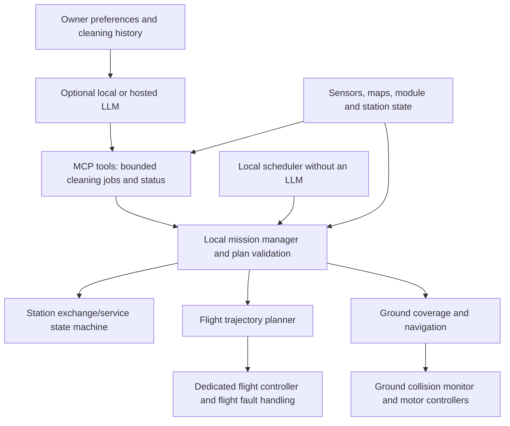

# Sensing, cleaning plans and open interfaces

2026-09-05 — proposed architecture. No navigation stack, MCP server or LLM client is
implemented by this document. It extends [DESIGN_RESET.md](DESIGN_RESET.md) while
preserving the three-section hardware arrangement and full automatic operation.

## Learn each home and check it against the actual robot

Maintain three independent, versioned descriptions:

| Description | Contents | Source |
|---|---|---|
| Robot and modules | Collision geometry in every operating state, mass/center-of-mass range, electrical limits, support contacts, tools, sensing coverage and calibration | Measured hardware profiles |
| Home | Floor maps, stairs/rails/headroom, stationary obstacles, docks, permitted areas and geometry uncertainty | Surveys plus sensor mapping |
| Live state | Localization confidence, current obstacles, module identity/retention, energy, supplies and service availability | Robot and station observations |

A plan is valid only for the current combination. Scan measurements can replace rough
home inputs; they cannot change the measured robot limits to make a route pass.
Changing a bottom or fitting the lift top updates geometry, mass assumptions, sensor
occlusions and control configuration before movement. Never use the cap-mode footprint
to plan a route while the rotor frame is attached.

Use a persistent map for layout, with a fresh local obstacle representation for dogs,
people, moved furniture and open/closed doors. Ground coverage uses a floor map with
height/overhang checks; flight and tread landings need a 3D representation including
negative obstacles and available support surfaces. Unknown depth is not free space.
Store observation age, uncertainty and coordinate frames with geometry. Inflate the
robot's swept volume for measured localization/control error and stopping behavior.

Scanning improves portability but does not let an oversized robot fit through a small
opening. Initial surveys can use safe floor positions, a handheld sensor or manual
measurements to cover occluded stair areas. Do not require the robot to fly an unknown
stair route in order to establish whether that route is usable. Reobserve critical
clearances and destinations during execution; a historical scan is insufficient for
a household with moving animals.

## Sensing candidates

| Function | Candidate sensing | Placement consideration |
|---|---|---|
| Ground localization and room mapping | Wheel encoders, core IMU, horizontal scanning LiDAR | Preserve a useful scan plane around the core in supported module combinations |
| Objects, rails and surface context | RGB-depth or stereo camera, with 3D LiDAR considered if coverage/mass justify it | Core front initially; additional viewpoints needed for other travel directions |
| Floor edges and contact | Downward short-range sensors, bumper switches, wheel/contact state | Bottom-specific placement and calibration; required on each wheeled bottom |
| Indoor flight state | Dedicated flight-controller IMU plus validated visual/LiDAR-inertial position estimation and range sensing | Lift configuration needs observation of all relevant approach/escape directions and overhead/below |
| Station alignment | Local camera or range sensing plus printed fiducials and physical guides | Fixed station view can supplement robot observations |
| Cleaning/service feedback | Roller/blower current, filter pressure or airflow where practical, bin/tank state, before/after images | Evidence for cleaning effectiveness and service demand; calibrate proxies against actual pickup |

These are capability candidates, not a requirement to purchase every listed sensor.
A 3D sensor may replace some other coverage if demonstrated adequate. Standardize
sensor messages and calibrations so different hardware can provide the same capability.
No single front camera supplies all-around flight coverage. Check fields of view and
minimum ranges with every supported attachment, and time-synchronize sensing used in
motion estimation. A station camera helps near the dock but does not replace onboard
flight estimation or observation between floors.

Test shiny tile/wood, dark fur, thin rails, glass, changing light and dirty sensor
windows. RealSense's own
[depth-quality guidance](https://www.realsenseai.com/wp-content/uploads/2019/11/RealSense_DepthQualityTesting.pdf)
describes surface and lighting limitations; software must preserve uncertainty when
returns are invalid. Image-based pet recognition can improve behavior, but an unknown
moving object must still affect collision handling even when it is not labeled a dog.

## Local control with optional language-model planning



The LLM can translate intent, select zones, choose among tested cleaning recipes,
summarize poor pickup and suggest schedule changes. For example: vacuum the kitchen's
high-hair zones again, finish downstairs dry jobs before mopping, then recharge before
the upstairs mission. A deterministic planner computes coverage and travel routes
under the robot's constraints. Compare pickup, coverage, time, energy, module swaps
and floor transfers against a non-LLM baseline; generated plans are not automatically
optimal because an LLM produced them.

Keep feedback-driven adjustments bounded: choose a tested pass count or suction
recipe, recheck the result, and stop repeating when the allowed attempt/energy budget
is exhausted. An LLM must not invent new motor limits, disable a cliff detector or
rewrite flight gains in response to poor cleaning.

ROS 2 and Nav2 are candidates for ground navigation. Nav2's
[Collision Monitor](https://docs.nav2.org/rolling/configuration_and_development/configuration_guide/core_servers/collision_monitor/configuring_collision_monitor_node/)
can act on sensor data to stop or limit ground motion; its documentation explicitly
does not claim hard real-time safety certification. It is not a flight avoidance
solution. A flight stack such as PX4 handles stabilization beneath a local trajectory
planner; PX4 documents companion-computer commands and loss-of-command handling in
its [offboard-mode guide](https://docs.px4.io/main/en/flight_modes/offboard).
These components require integration and testing; they do not establish autonomous
stair flight or animal protection out of the box.

An onboard computer runs local perception and mission execution. A station or home
server can host expensive planning and the MCP gateway. Select a local or hosted
LLM through an adapter; an LLM API/network outage must not interrupt stabilization,
collision checks or a station's supported exchange. Existing validated jobs can
continue if current conditions permit. Loss of needed local sensing or control has
a separate mode-specific response; flight must not copy the floor robot's immediate
motor-stop response.

## Proposed MCP surface

MCP supplies structured tool access between a client application and the robot's
mission service. It is not a motor bus or a requirement for onboard real-time loops.
The official [MCP tools specification](https://modelcontextprotocol.io/specification/2025-11-25/server/tools)
defines input schemas and structured tool results. The following names are our
proposed application tools, not existing MCP standard tools:

| Tool | Effect |
|---|---|
| `get_capabilities` | Read supported tools, operating modes and validated limits |
| `get_environment_summary` | Read named zones, route availability, map version and uncertainty |
| `get_status` / `get_cleaning_history` | Read robot, station, service and measured job outcomes |
| `submit_cleaning_job` | Submit a typed zone/recipe request to local validation and scheduling |
| `get_job_status` | Read progress, blocked reasons and completion evidence |
| `pause_job` / `cancel_job` | Request an orderly mode-appropriate pause/cancellation |

Example job payload (illustrative contract; no executable schema exists yet):

```json
{
  "request_id": "example-kitchen-001",
  "zone_ids": ["downstairs_kitchen"],
  "recipe_id": "hard_floor_vacuum",
  "passes": 2,
  "allow_recharge": true,
  "allow_floor_transfer": true
}
```

The server checks known zones/recipes, authorization, bounded parameters, tool
availability and mission feasibility. It derives module exchanges and transfers;
the model does not send raw latch, arm, thrust, voltage or velocity commands. Recheck
map freshness, occupancy, energy reserve and retention at execution boundaries.
Duplicate request IDs must not enqueue repeated physical work. Conflicting jobs share
one robot scheduler; long operations return a job ID and expose progress explicitly.

Full automation uses owner-configured standing permissions for validated job types;
routine jobs do not require repeated human approval. Enforce those permissions in
server/controller code. Model text, room labels and observed writing cannot grant
new permissions. Authenticate clients and restrict access to the local network by
default. The integration should send summarized state to a hosted LLM by default;
image upload is a separate owner-configured feature. An LLM cannot mark an untested
flight configuration as validated.

## Open-source portability and verification

Keep editable CAD, printable/exported parts, wiring, module profiles, protocol
contracts and calibration procedures together. Separate robot profiles from home
profiles and user preferences. Use explicit units and schema versions, and reject
unsupported combinations instead of silently substituting dimensions. Document
alternative component capabilities so reuse is possible without claiming arbitrary
sensors or motors are drop-in replacements.

The [example home profile](../config/examples/straight_stair_home.json) records this
house using SI units, known approximate inputs and explicit unknowns. It is design
data only; no runtime consumes it yet. Never store household maps or API credentials
in a public release by default. License choices for original code/hardware/docs and
third-party assets need a deliberate review before publication; no license is assigned
by this proposal.

Validate in stages: recorded sensor replay and simulated obstacles; floor navigation
and cleaning feedback; automatic station exchanges; then flight estimation, avoidance
and stair operations in an appropriate controlled test setup. Include stale sensors,
network loss, duplicate jobs, incompatible modules, occupancy changes and interrupted
swaps. The LLM layer is added after local job execution works and compared against
the same jobs from a simple local scheduler.
