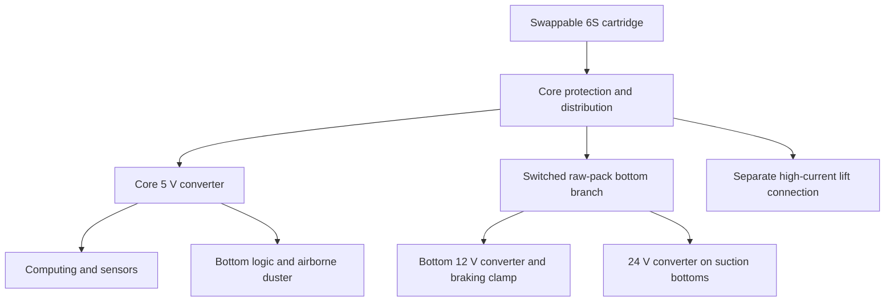

# Core and floor-power partition — revision F

Follow-up: [revision G frame/joint candidate](FRAME_JOINT_DESIGN.md) adds
dimensioned core corners and rails, updates the top-seat height and clears the
proposed floor-bridge route. It retains the F power architecture and full carrier
mass; the F figures below remain the comparison baseline.

This is the first concrete candidate from the [weight optimization review](MASS_OPTIMIZATION_REVIEW.md).
The shared core no longer carries the blower converter or drive converter/braking
circuit. Those move with the bottoms that need them. The airborne duster retains
its existing 5 V tool electronics and omits both floor-power assemblies.

Start with the [layout viewer](../design/system/output/core_partition.html),
[complete before/after report](../design/system/output/core_partition.md), or
[hardware ledger](../design/system/output/core_partition_hardware.csv).
The [editable F inputs](../config/core_partition.json) transform the existing
C whole-system and E airborne inputs; they do not overwrite those comparison
records. F controls the proposed power partition and revised mass accounting.
The old viewers still show their original power layout and mass.

| Same loaded robot, same battery and top | Estimated change |
|---|---:|
| Airborne duster | −246 g |
| Mop/drive | −103 g |
| Vacuum/drive | +87 g |
| Under-sofa vacuum/drive | +87 g |

The fixed core changes from **1,439 to 1,193 g**, excluding cells and the unchanged
140 g removable cartridge tare. A complete four-propeller duster changes from
**5,249 to 5,003 g**. This is a proposal with installation allowances, not a
weighed assembly. Vacuum and sofa loads still carry their converters and gain
the conservative added support/interface hardware. We have not deducted any
existing frame or converter-carrier material in anticipation of future integration.

The proposed floor carrier uses cut aluminum sheet/strip and tube with steel
through-rods. Its notched shelf and relocated braking components clear the core
camera during upward core removal. The core's 5 V regulator moves above its
left MCU. Ground allocations remain inside 275 × 275 × 180 mm, subject to the
existing sofa-head overhang exception. These are dimensioned stock and component
envelopes: support joints, fastening, insulation, shell contour and structural
stiffness still need detail before printing or cutting parts.

The revised bottom interface supplies switched raw 6S power and protected 5 V
logic, with 12/24 V conversion local to the floor bottoms. It requires a new
physical key and module identity; the previous regulated-rail interface is
electrically incompatible. Contact selection, branch protection and automatic
connection sequencing remain design work. Battery chemistry, cell selection,
high-current lift delivery and the cartridge mechanism are not selected by this
change. The full electrical contract is in the generated report and F inputs.



No pickup area, bin volume, mop-water capacity, sofa reach, sensor count, guard
or energy reserve is reduced. That preserves the specified functions, but
equivalent performance still requires later hardware validation. The nominal
duster calculation improves to about 84 seconds of local cleaning from 74;
these are energy ceilings after modeled travel/reserve overhead. A barely
2.002:1 static thrust screen remains within design uncertainty, so it does not
establish adequate flight margin.

CAD allocations:

- Vacuum: [FreeCAD](../design/system/output/core_partition.FCStd) / [STEP](../design/system/output/core_partition.step).
- Mop: [FreeCAD](../design/system/output/core_partition_mop.FCStd) / [STEP](../design/system/output/core_partition_mop.step).
- Sofa: [FreeCAD](../design/system/output/core_partition_low.FCStd) / [STEP](../design/system/output/core_partition_low.step).
- Airborne duster: [FreeCAD](../design/system/output/core_partition_duster.FCStd) / [STEP](../design/system/output/core_partition_duster.step).

Reproduce from the repository root:

```sh
python3 design/system/core_partition.py
python3 -m unittest discover -s design/system -p 'test_*.py' -q
freecadcmd design/system/export_core_partition_freecad.py
```

The [verification record](../design/system/output/core_partition_validation.md)
distinguishes arithmetic/geometry checks from the unfinished fabrication and
physical tests. Next, detail the shared frame and mounting joints so carrier
supports can be integrated without counting the same structure twice.
