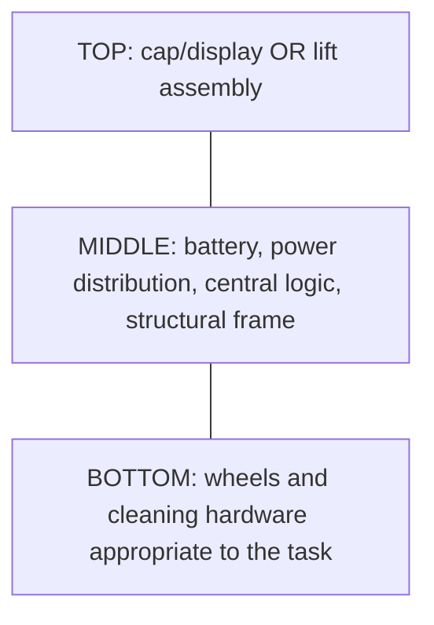

# TidyBot: three-part design proposal

> **Scope update, 2026-09-13:** [Whole-system design](SYSTEM_DESIGN.md) now controls
> cross-module layout, carried mass, lift sizing and battery decisions. This
> earlier study remains supporting evidence; its lift deferral or battery-first
> recommendation, where present, is superseded.

Draft for discussion, 2026-09-05. This is a fresh architecture proposal based on the
owner's current brief, not a build-ready specification or a flight-qualified design.
Dimensions and budgets below are provisional. The
[archived CAD](../archive/previous-design/cad/) implements the earlier TB-Port
experiment; it does not implement this proposal. Earlier specifications and decisions
are retained in the [archive](../archive/README.md) as historical reference.

**Current work order, updated 2026-09-05:** design the core and ground modules
first. Defer all propulsion selection, sizing and testing until their dimensions
and carried masses are established. The [ground module design](GROUND_MODULE_DESIGN.md)
supersedes the earlier packaging and work sequence. The owner confirmed an
automatically deployed cleaning head for the reported 50 mm sofa clearance while
the main robot stays outside. The working design is a separate low-clearance bottom
for approximately 36-inch-deep sofas accessible only from the front.

**Ground size update, 2026-09-06:** the current core/vacuum/cap placement has a
275 × 275 mm rigid footprint limit and 180 mm total height limit, including the
scanner. Flexible bristles may extend, as confirmed by the owner. Main panels
target whole 270 × 270 mm prints. The [compact placement](GROUND_PLACEMENT.md)
supersedes earlier dimensions and preferred print spans below. Other deployed
attachments and the deferred flight top still need their own envelope studies.

The robot has three externally interchangeable sections:

The middle is called the **core** to avoid confusing an electronics base with a
wheeled chassis. It has no permanent wheels. A removed core rests on a simple stand.

**Confirmed by the owner:**

- Flight-carried mass budgets, added 2026-09-14: **4.5 kg maximum** for short
  transfer flights and **3.5 kg target** for sustained hovering work, including
  the core, battery and loaded working module, excluding the lift top. See
  [mass boundaries and current gaps](MASS_BUDGETS.md).
- The propeller top must lift the entire assembly: core and attached cleaning bottom.
  Inter-floor transport is required; cleaning the stairs themselves is also of interest.
- Operation must be fully automated, including bottom and top exchanges. Plan for
  one station on each of the two floors, with automatic charging and tool handling.
- There is no fixed budget ceiling. Present costs and tradeoffs so the owner can
  challenge excessive options; reuse suitable existing inventory. This replaces
  the earlier $1,000 target and does not authorize purchases. The owner additionally
  confirms replacements are acceptable when owned parts are too heavy, large or
  underpowered; component reuse must not override the cleaning/design objectives.
- Priorities are vacuuming first, mopping second, higher-area cleaning third.
  Three dogs produce substantial hair; exceptional pickup on wood and tile is a
  design objective. There are no carpeted surfaces in the stated environment.
- The home has two floors totaling approximately 2,000 ft², split equally, all wood
  or tile. Recharging during a cleaning job is acceptable.
- The staircase is straight, with 15 reported stairs, 11-inch treads and approximately
  7.5-inch risers. Reported width is 36 inches. The left side has a 1.5-inch lip at
  approximately 37 inches vertically above the treads; the right rail projects about
  4 inches at approximately 36 inches vertically above the treads. The owner confirmed
  that the stairs themselves are 36 inches wide and the features overhang that width.
  Their detailed cross-sections and vertical extents remain to be measured/scanned.
- The landing is open wood floor with a 12-inch bookcase against a wall approximately
  36 inches from the stairs. Its position relative to the arrival path is not yet
  dimensioned. Landing on individual treads to clean is acceptable. The owner also
  proposed blowing debris down to the lower floor for subsequent vacuuming.
- The three dogs cannot be guaranteed to stay away during operation. The design
  must handle their presence and cannot depend on them learning to avoid the robot.
- The project is intended to become open source and adaptable to other homes and
  component inventories. The owner proposed camera/LiDAR environment scanning and
  an MCP server with an LLM integration for adaptive cleaning plans. These are now
  covered in the [autonomy proposal](AUTONOMY.md); no integration is implemented yet.
- Station candidates are the downstairs tile kitchen and upstairs master bedroom,
  both with substantial available space. The default station must operate without
  plumbing, using manually serviced water and waste containers at a measured interval.
  Optional kitchen water access may be added later. Routine cleaning, module swaps
  and charging remain automatic; periodic refill, emptying and maintenance are accepted.
- Available tools include soldering and crimping equipment, a multimeter, drills and
  a drill press. The owner has some electronics experience and no drone-building
  experience. TAZ 6 printing and purchased parts remain the preferred fabrication
  methods; machining beyond available tools must be discussed.

**Proposed staging assumptions:** manual, powered-off swaps are acceptable for early
mockups; local motor controllers may live with their motors; initial cleaning trials
are supervised. Manual swaps are a development step toward the required automated
stations, not the finished operation. A detached drone would not meet the confirmed
whole-assembly flight requirement. Routine onboard bin emptying and mop servicing
are included in the station study, with bulk containers manually serviced as needed.

## Where the earlier architecture drifted

| Earlier decision | Consequence | Proposed correction |
|---|---|---|
| Wheels permanently in the middle | Bottom swaps cannot directly change locomotion | Put locomotion in the bottom |
| Passive modules as a universal rule | Restricts vacuum, mop and rotor mechanisms; conflicts with local module electronics elsewhere in the documents | Share energy and central logic; allow task-specific motors, drivers and small controllers |
| Unattended swapping drove the port before robot packaging | Adds actuators and blind mating before loads and access are known | Co-design the required automatic stations and robot packaging; prove joints by hand first |
| Robot diameter limited by one print | Artificially restricts packaging | Limit each printed component, assemble larger frames if needed |
| Port must be finished before robot layout | Optimizes an interface before knowing the equipment it joins | Develop packaging, weight and a simple joint together |
| Small steel-feature margins treated as structural assurance | Omits likely failures in plastic anchorage, frame bending and retention | Verify the complete assembled load path |

There is useful work to retain: parametric CAD, small fit coupons, replaceable panels,
separation of dirty and electrical spaces, and awareness of tension loads during lift.
The legacy interface also has discrepancies: cross-pin descriptions coexist with a
grooved-post rotating lock plate, and the roadmap defers flight while the structural
ADR assumes it. These are reasons to re-baseline, not reasons to discard all the files.

## The proposed sections

| Section | Contains | Design intent |
|---|---|---|
| Core | Removable purchased battery pack, main protection/disconnect, separately protected power branches, logic regulators, central MCU, optional SBC, wiring and structural frame | Reuse expensive energy storage and central computing |
| Floor bottom | Two driven wheels with encoders, support wheel(s), motor drivers, floor-facing sensors, bumper and task hardware | Every mobile floor bottom works without core-mounted wheels |
| Cap top | Lightweight cover, optional display/buttons | Keep the first robot light and serviceable |
| Lift top | Purchased motors/propellers/ESCs, flight controller, appropriate sensors, arms, guards and attachment structure | Share the core battery only after its flight current capability is established |

Use one reusable **bottom chassis design** with internal vacuum, mop and dry-duster
cartridges. An assembled bottom remains one of the three external sections. For the
finished automatic system, build complete bottoms with their own drivetrains so the
station exchanges an entire bottom without transferring motors. Reusing one physical
drivetrain between hand-built cartridge experiments is an early development option.
A later tracked bottom could use the same core attachment, but would not replace
the required whole-assembly flight capability.

Keep vacuum blower, filter, bin and dirty-air path entirely below the core. Keep the
mop reservoir, pump, pad and all liquid plumbing there too, with a separate containment
tray and drainage away from electrical plugs. Neither air nor water crosses the
section joint. Begin the mop with a removable pad and manual wetting; add a metered
pump only after measuring drag and leakage. A dry pad can serve as a quick drivetrain
load test, but the first functional cleaning module is the vacuum.

### Vacuum design for three dogs and hard floors

Design the intake, brush and bin as a system and compare pickup on actual household
hair and grit. Do not select the blower solely by electrical wattage or a sealed
suction figure. Candidate features are a removable roller with accessible ends,
hair shielding at bearings, smooth short passages without snagging ribs, a generous
removable bin, and a washable or replaceable filter according to its supplier's
instructions. Compare a soft roller, rubber-fin roller and brushless suction head
on the same test debris before choosing the mechanism. These are test candidates,
not claims of demonstrated hair resistance.

Evaluate edge pickup, repeated-pass pickup, hair wrapping, filter loading, wheel/caster
hair buildup, cleanup time and floor marking. Check performance with a partially
loaded bin/filter, not just freshly cleaned hardware. Weigh the maximum intended
debris load for flight sizing. The mopping version also needs a bounded maximum
liquid load and control of liquid movement when the robot tilts.

A high-area duster needs a defined reach and contact-force strategy. A long tool
hanging below a flying stack can retain the three-section layout, but increases
moment, collision envelope and control demands. Hovering near a shelf and cleaning
it through contact are separate demonstrations.

## A joint we can build before owning a machine shop

Start with a broad, flat mating flange and four accessible perimeter fasteners per
face. Use purchased screws, washers and captive metal nuts in printed pockets. Broad
seating pads carry compression; the fasteners retain separation. Short printed
registration lips help hand alignment, with generous clearance so they do not fight
the fasteners. Add an asymmetric key/tab to prevent reversed assembly.

Use the same provisional structural mounting pattern on the core's top and bottom,
but key and label their electrical connections differently. Mechanical compatibility
does not imply that every module is electrically or functionally valid on either face.
Choose the bolt spacing after laying out the battery and bottom hardware. An initial
packaging sketch can explore a 160–200 mm square pattern inside a roughly 260–300 mm
body; these are study dimensions, not released CAD dimensions.

The core has upper and lower perimeter frames linked by purchased metal spacers and
bolts. Provide access to each face's screws without removing the opposite module.
For floor prototypes, reinforced printed flanges are candidates. For flight, include
metal load spreaders and evaluate bolt pull-through, plastic creep, arm roots and
frame bending: metal bolts alone do not make a printed assembly flight-ready.
Prefer purchased brackets/plates and pre-cut stock; custom drilled or machined plates
remain a decision to discuss against the actual tools available.

Power and data use separate, manually connected, polarized plugs in recessed side
pockets with strain relief. Mate with battery power isolated; no energized swapping
or pogo-pin power interface in the first prototype. A simple cradle supports the core
while changing the bottom. Tool-less retained fasteners can follow if swap frequency
justifies them. Station-actuated retention and guided electrical mating are required
development work; the hand-connected prototype does not fulfill automatic swapping.

### Required base stations

Reserve accessible structural support surfaces on the core so a station can carry
its weight before releasing the bottom. A candidate station has a guided parking
cradle, a short lift/support mechanism and storage for complete bottoms. It must
support the core independently of the wheels being removed. The station, rather
than the robot, is a candidate location for the swap actuators to limit flying mass.
The full swap mechanism and clearances need a packaging study; this is not yet a
selected mechanism.

Specify separate sequences for arrival, weight transfer to the station, disabling
module power, release, exchange, positive retention, electrical checks and departure.
Mechanical retention must remain secure without continuous actuator power. Recovery
from a failed exchange must leave every section supported. Provide separate overhead
top handling and lower bottom handling paths; both exchanges must be automatic.
Each of the two stations must accept the arriving lift top and fit a cap, then reverse
that operation before departure. Empty storage positions and the whereabouts of the
single shared lift top/caps must be tracked across floors. Tool inventory per floor
is a cost and storage choice, not a reason to duplicate the core or lift top.

Include charging and automatic transfer of onboard debris into a larger stationary
container. Study metered mop filling, dirty-water handling and pad washing/drying as
part of the later mopping phase. Use removable clean-water, dirty-water and debris
containers by default; plumbing is an optional station accessory. Measure the service
interval and pause affected jobs before supplies run out or waste capacity is exceeded.
Bulk consumable replacement and mechanical maintenance are accepted service tasks.
See [the packaging study](PACKAGING_STUDY.md) for the
proposed operating cycle and station arrangement.

## Power and control

Keep the battery in the core as requested, but make its tray replaceable. A 6S lithium
pack is a candidate, not an adopted requirement: six 3.6 V nominal cells mean 21.6 V
nominal and 25.2 V fully charged. A pack using 3.7 V nominal cells is labeled 22.2 V.
This is not a regulated 24 V supply. Set minimum operating voltage and protection
from the selected cells/pack, and verify all loads over the actual voltage range.

The cap needs only low power. The floor bottom gets its own protected motor/tool
branch. The lift top gets a separately sized high-current path; it cannot inherit the
legacy 40 W top-port allowance. Choose connectors, wire, switches and protection
from measured continuous and transient currents, voltage sag and connector heating.
Battery capacity in Ah alone says nothing about suitability for flight current.

Central logic sends motion and cleaning commands; small controllers in the modules
handle encoders and motor loops. CAN is a reasonable candidate to retain, subject to
a concrete transceiver, harness and termination design. The controller in the core can
be an MCU for early driving trials, with SBC space reserved for later navigation.
The lift module needs a dedicated flight controller rather than depending on the
navigation computer for stabilization.

Floor modules stop on lost commands and power up disabled. A flight system needs its
own explicitly designed communication-loss and low-energy responses; copying a floor
rule that instantly cuts motor power on communication loss would cause a fall.
No module may unlatch while its actuators are enabled or its weight is unsupported.
For station exchanges, disable the exchanged module's power branch and disarm the
rotors while retaining core/station control power as needed. Define flight arming and
complete retention checks before any assembled lift test.

## Printing and purchased hardware

Use the repository's 280 × 280 × 250 mm TAZ 6 envelope as the planning input and
verify the installed toolhead and usable slicer area. LulzBot's stock TAZ 6 profiles
specify a [0.50 mm nozzle](https://lulzbot.com/content/taz-6-cura-profiles).
Keep initial individual parts within approximately 250 × 250 × 230 mm to allow
margin. The assembled robot may be larger.

Print frame segments, covers, ducts, bins, motor mounts, sensor brackets and fit
coupons. PETG is a candidate for general prototypes, with temperature and load checks
around motors and batteries. Use purchased bearings, wheels/tires, gears, fasteners,
electrical plugs and a matched battery/charger. Buy the vacuum impeller/blower and
flight propellers; printed ducts and guards are different from validated rotating parts.

Do not adopt sub-0.1 mm registration as a requirement without a task that needs it.
Printed hand-alignment surfaces can be adequate after fit testing. Use washers and
through-fastened joints for significant loads; heat-set inserts are useful for covers
but should not automatically be the primary suspended-load retention.

The first mechanical mockup should require printing and ordinary fastener assembly.
The owner has the soldering/crimping tools, meter and drill press needed to explore
wiring and simple drilled brackets. No lathe, reamer, mill or hand-cut precision
grooves are assumed; any part requiring additional equipment must be discussed.

## Deferred flight feasibility reference

The owner has explicitly deferred this work until the other modules are designed
and weighed. Keep battery trays and interface cassettes replaceable, but do not
size propulsion or freeze flight-driven body dimensions now. The calculations
below retain earlier context only; they do not set the current ground design.

The following are sensitivity cases, not predictions of finished mass. All-up mass
includes the battery, core, bottom, rotor assembly, guards, fasteners and carried dirt
or water. For four non-overlapping 15-inch rotors, total disk area is about 0.456 m².

Using `P_ideal = (m*g)^(3/2) / sqrt(2*rho*A)`, with `g = 9.81 m/s²` and
`rho = 1.225 kg/m³`:

| All-up mass | Ideal hover power | Per-rotor thrust for a provisional 2:1 total thrust/weight target |
|---|---|---|
| 3 kg | 151 W | 1.5 kgf |
| 5 kg | 325 W | 2.5 kgf |
| 7 kg | 538 W | 3.5 kgf |

These are ideal aerodynamic lower bounds, not battery power estimates. They omit
profile drag, electrical losses, guards, body interference and nearby walls. The
equation follows the [NASA hover momentum model](https://rotorcraft.arc.nasa.gov/Publications/files/Johnson_AHS-SF2004.pdf).
The 2:1 target is an initial sizing assumption, not a proof of controllability.

For a concrete reference, T-Motor reports its MN4014 KV400 with a 15×5 propeller at
22.2 V producing 1.25 kgf at 126.54 W, and 2.62 kgf at 415.14 W. Four such test points
imply about **506 W at 5 kg hover thrust** and **1,661 W at maximum bench thrust**,
or roughly 23 A and 75 A. This is a scale illustration, not a selected propulsion
system or a prediction with guards installed. See the
[manufacturer's test table](https://store.tmotor.com/product/mn4014-kv400-motor-navigator-type.html).

In a square rotor layout, adjacent centers must be at least a propeller diameter
apart. Four 381 mm propellers therefore occupy at least **762 mm square**, before
blade clearance and guards, with at least about 539 mm between opposite motors.
The assembled body's clearance from the disks can increase those dimensions.
Compare the entire swept and guarded envelope with the narrowest stairwell section,
handrails, landings and required maneuvering margin. Frame diagonal alone is misleading.

The reported 36-inch stair width is 914.4 mm. Against the ideal 762 mm rotor envelope,
only 152.4 mm total, or 76.2 mm (3 inches) per side when perfectly centered, remains.
That is before guards, blade separation, rail intrusions or maneuvering margin. It
does not establish that 15-inch rotors fit operationally; smaller rotors and a lower
all-up mass need evaluation. The reported 11-inch tread depth is 279.4 mm: landing
on individual steps adds a separate wheel-support and tool-reach constraint even
if airborne transport fits the stairwell.

The owner confirmed that the projections overhang the 36-inch tread width. A
conservative envelope combining both projections is `36 - 1.5 - 4 = 30.5 inches`
(774.7 mm). Their reported heights differ by an inch and their thicknesses are unknown:
this is not yet a measured minimum clear width at one elevation. In that combined
envelope a 30-inch ideal rotor layout leaves only half an inch total before blade
separation and guards. Measure or scan the height-dependent clearance and complete
flight path; neither constant 36-inch nor constant 30.5-inch width describes it fully.

A short stair ascent may consume little energy but still needs full instantaneous
hover/climb power. For illustration, one minute at 800 W is 13.3 Wh; a small pack
must nevertheless deliver the current with control and landing reserve. Rotors also
move substantial air: the ideal disk velocity in the 5 kg example is about 6.6 m/s.
That is a reason to test dust disturbance and tool interaction, not a prediction of
air speed at a shelf.

Whole-stack lift is a confirmed requirement whose feasibility is still open. Close
mass, thrust, power, structure, indoor localization and spatial-clearance budgets.
Size for the actual cleaning bottom and permitted debris/water load. If those budgets
cannot close within the house dimensions and an acceptable cost, report the conflict
and discuss changes explicitly. A detached aircraft or mechanical stair climber
does not fulfill the current requirement.

### Dogs and autonomous flight

Treat moving animals as an ongoing operating condition. Study complete rotor access
protection, including above and below the disks, with sufficient separation under
deflection; a perimeter ring alone does not address paws or fur. Include guard mass,
airflow loss, motor heating and impact loads in testing. A cage cannot by itself
establish that a falling or colliding assembly is acceptable around animals.

The proposed controller waits on the floor when its transfer path or destination is
occupied. During flight it must continually update occupancy and have a reachable
abort/landing location with energy reserve; a preflight check alone is insufficient.
Do not treat a dog's expected cooperation or a generic obstacle-avoidance setting as
verification. As a relevant limitation of existing technology, Flyability explicitly
states that its Elios 3 return-to-home function is not supported in dynamic
environments and can miss moving obstacles in its
[automation guide](https://knowledge.flyability.com/aircraft/elios-3/elios-3-feature-details/elios-3-return-to-home-and-resume-inspection-user-guide).
That is not a claim that all flight controllers have identical limitations.

If we cannot demonstrate protection and a workable response to a dog entering the
route, autonomous stair flight in that setting remains unavailable. Automatic waiting
and reporting a blocked transfer are valid behaviors; uninterrupted flight through
an occupied route is not a promised capability.

## Work sequence and review points

1. **Package the core, everyday vacuum bottom and cap.** Position component
   envelopes, service paths and interfaces. The dedicated low-clearance bottom's
   long-reach mechanism is separate from this first build.
   Keep print segments within the TAZ 6's usable envelope. Present a consolidated
   compatible parts list and costs with the dimensioned layout.
2. **Develop the automatic joint and station support together.** Print a small
   mating sample and then the core/cap/chassis. Manual bolts and powered-off swaps
   are temporary development stages; preserve latch and connector space for the
   required automatic exchanges.
3. **Make the vacuum bottom drive and clean.** Measure traction, pickup, hair wrap,
   loaded-filter behavior, current, temperature, runtime and floor marking using
   the actual module. Record component and complete-module masses, including dirt.
4. **Demonstrate automatic docking and bottom exchange.** Integrate local control,
   retention checks, charging, emptying and floor navigation. Develop the cap
   handling interface; repeat the working station design on the other floor later.
5. **Design low-clearance, mop and duster bottoms against the same interface.**
   Include complete drivetrains, local controllers and bounded operating contents.
   Establish stowage and coverage for the front-access low head. Verify wet
   containment and pad service, and measure complete dry/loaded masses.
6. **Resume lift work with measured payloads.** Add the eventual lift hardware and
   any battery/power changes to the known core and chosen bottom. Flight selection,
   testing and high-area positioning remain deferred until this point; automatic
   inter-floor transfer remains a requirement whose feasibility is unresolved.

See [GROUND_MODULE_DESIGN.md](GROUND_MODULE_DESIGN.md) for construction details and
the measurement records. No fan test fixture or propulsion purchase is needed for
this phase. Retain earlier studies as references rather than freezing their guessed
mass, 6S battery or stair-driven body envelope into the ground robot.
