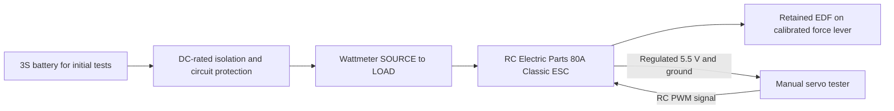

# First EDF bench experiment

**Deferred 2026-09-05:** the owner rejected the approximately $825 fixture cost.
The owner has also deferred all propulsion comparison, selection and sizing.
Current work is [core and ground modules](GROUND_MODULE_DESIGN.md). The procedure
below is retained history, not a build or purchasing instruction. No powered
measurements have been taken.

Status: test design brief, updated 2026-09-05. A
[stand layout and retaining cradle prototype](../design/experiments/edf_bench/README.md)
are available. The owner reports the housing gauge fits without force, but the
printed v1 cradle interferes with a central raised ring. The
[v2 correction](../design/experiments/edf_bench/CRADLE_V2.md) includes the measured
75.5 × 1.5 mm ring, centered on the ear holes. The owner confirms the body/ring
fit on the cable-free side. Use one cradle underneath with the cable exit upward;
the fan is now installed with M3 nuts and bolts. The
[complete hardware list](../design/experiments/edf_bench/HARDWARE_LIST.md) and
[order CSV](../design/experiments/edf_bench/hardware.csv) consolidate the remaining
stand, wiring and instrument purchases. The owner can cut wood and has no shaft
or bearings; no further inventory question is pending for this order. The
[moving mounting board](../design/experiments/edf_bench/MOUNTING_BOARD.md) is one
step within the full stand assembly.
Fixture details and powered-run limits remain to complete. No
thrust or electrical measurements have been taken.

## Decision this experiment supports

Measure the owner's DD 70 mm, 12-blade, 3400KV, 4S EDF to determine whether its
compact size warrants an alternative lift layout. Preserve the
[9-inch concept](CONCEPT_FINDINGS.md) as a reference until we have comparable data.
The robot still needs to carry its core and complete attached cleaning bottom.

At the current reference mass of 4.2224 kg with four equal lift units:

| Quantity | Per fan | Meaning |
|---|---:|---|
| Static hover requirement | 1.056 kg-force | Minimum average installed thrust to balance weight; not a control reserve |
| Provisional 2:1 thrust/weight target | 2.111 kg-force | Available thrust target; not a continuous hover requirement or universal flight rule |

These values must be recalculated for an EDF robot's actual mass, battery, fan
count and installation. Test results from an unobstructed fan do not include a
future robot's guard, body, inlet or outlet losses. One fan also does not establish
unit-to-unit variation, yaw control, fan response or flight feasibility.

## Known inventory and source quality

The owner reports one fan with the title "DD 70mm EDF 12 Blades Ducted Fan with
3400KV RC Brushless Motor Balance Tested for EDF 4S RC Jet Airplane" and motor
marking D2842-3400KV-4S. The matching
[Flycolor/DD listing](https://www.amazon.com/dp/B09L4XYNGW) advertises 1,810 g-force
maximum thrust, a 4S supply up to 16.8 V and an 80 A ESC recommendation. These are
seller claims, not measurements of the owner's unit.

Its electrical specifications conflict: the description lists 75 A and 1,638 W,
although 16.8 V x 75 A is 1,260 W; another table lists 38 A. Establish operating
limits from the selected hardware and its documentation, not that power headline.
Keep this 4S fan off the proposed robot's 6S supply.

The earlier 1,435 g-force / 776 W comparison was a
[4-Max measurement of a PowerFun fan](https://www.4-max.co.uk/edf-pf-70mm-4S.html).
That is comparison data, not a curve for this DD fan. The seller's 1,810 g-force
claim would give four fans 7.24 kg-force total, or 1.71:1 against the existing
4.2224 kg mass before a redesign or installation losses.

## Owner inventory and next selections

| Item | Owner-reported inventory | Remaining details |
|---|---|---|
| EDF housing | Body minimum OD 74 mm, duct length 66 mm excluding motor, lip OD 75.5 mm, ear span 91 mm; hole spacing approximately 82.5 mm; holes 4 mm, ears 20 x 8 x 3 mm; hole centers 37 mm from intake face; gauge and v2 body/ring fit passed on the cable-free side | Three-cable exit is 6 × 11 mm as reported, between ears on motor side of ring. M3 installation reported; attach moving board next. Use cables upward and check routing. Motor protrusion/root details remain unmeasured |
| ESC | RC Electric Parts 80A Classic Brushless ESC | Confirm physical connector sizes and condition against the current product page |
| Battery | Zeee 3S 5200 mAh 50C 11.1 V soft-case pack, XT60; ASIN B0972RKJDS | Condition, individual cell readings and actual lead condition; no 4S pack reported |
| Charger | Tenergy balance charger; photo resembles a TB6B, exact revision unconfirmed | Confirm LiPo balance connections and suitable input supply; photo currently shows NiCd CHARGE menu |
| Throttle control | No servo tester or RC transmitter/receiver | Recommend a simple manual tester below |
| Electrical measurement | KREATORDIRECT meter, ASIN B08MKZL4VY; owner supplies 50 A continuous, 0-60 V listing specification | Photo says 150 A, listing range says 0-200 A; do not rely on either as a continuous rating. Bare/tinned leads need insulated connections; calibration and measurement point remain to check |
| Force measurement | AWS SC-2kg; owner measures 100 x 100 mm platform; manufacturer specifies 2,000 g capacity and 0.1 g readability | Actual preload, filtering/hold/auto-zero behavior, repeatability with the lever and under vibration |
| Temperature measurement | Not yet reported | Selected two-probe logger and buy-if-missing IR thermometer in the complete hardware list |

The [80A Classic product page](https://www.rcelectricparts.com/80a-esc---classic-series1.html)
specifies 2-6S, 80 A continuous, a 5.5 V/4 A UBEC, XT90 battery connection and
4.0 mm motor bullets. These support using this ESC as a bench candidate; they do
not prove its temperature or commutation performance with this fan. Inspect the
actual connectors: the EDF listing describes 3.5 mm bullets, so a correctly rated
adapter or connector replacement may be needed.

The [ESC manual](https://www.rcelectricparts.com/classic-esc-user-guide.html)
specifies a 50 Hz RC control signal with nominal 1,000-2,000 microsecond endpoints
and provides throttle calibration. Its signal-loss shutdown is delayed, so loss
of the command signal is not our emergency power interruption method.

**First test stage:** use 3S for initial low-power characterization once pack and
instrument limits are established. It is within the ESC voltage range and below
the fan's 4S maximum. Lower voltage alone does not establish a suitable current
rating for the battery. Do not interpret a 3S result as the fan's 4S performance
or extrapolate a final 4S curve from it. Select a 4S pack later if the initial
results justify continuing. The test bench's 3S pack does not replace the robot's
provisional 6S battery design.

**Tester recommendation:** [ProtoSupplies TST-20](https://protosupplies.com/product/servo-tester/),
listed at $2.95 before shipping/tax when checked on 2026-09-05. The supplier's own
evaluation reports nominal 50 Hz operation, 4.8-6 V power, manual mode at startup,
and shared power pins. Use manual mode with minimum command verified; neutral
and automatic sweep modes are inappropriate for this fan. Check the actual pulse
endpoints and ESC arming before a powered fan run. No radio is needed for this
bench controller. A [ToolkitRC ST8](https://www.toolkitrc.com/st8/) is an optional
upgrade for numerical pulse settings; it needs its own power arrangement, not
the simple tester's wiring below. Neither tester is a flight controller.

The [AWS SC-2kg specifications](https://awscales.com/sc-2kg-precision-digital-pocket-scale-2kg-x-0-1g/)
give 2,000 g capacity and 0.1 g readability. The new draft places a **2:1 force
lever** ahead of the scale: 2.111 kg-force of thrust adds about 1,055.6 g to its
reading. Thus the earlier direct-scale range concern does not require an immediate
replacement. Taring still does not restore capacity: record the gross baseline
and stop below the proposed 1,800 g gross working limit. With an example 200 g
baseline, that corresponds to 3.2 kg-force thrust; the baseline must be measured.
Calibration, hysteresis, display behavior and vibration remain to check. A suitable
load cell or larger instrument is a fallback if the pocket scale cannot provide
repeatable measurements.

The owner supplied the [exact meter link](https://www.amazon.com/dp/B08MKZL4VY),
then its listing text and a photo after page retrieval failed. Adopt **50 A
continuous** from that supplied text as the planning rating; it is not a physical
validation. The photographed 150 A marking conflicts with the listing's 0-200 A
range, so neither is used to authorize high-current bursts. Start with a proposed
20 A ceiling and consider a later 40 A operator stop only after initial checks;
wire, connector, temperature, cell-voltage and duration limits may be lower.
These thresholds are not automatic current limiting.

The meter photo shows bare/tinned SOURCE and LOAD leads, with a visible 12 AWG
marking. Fit properly mating insulated connections and check the entire path.
Leave the thin auxiliary lead unused and insulated for the 3S test; its pinout
is not confirmed. The seller's claim about preventing current damage is not
evidence of protection: treat this as a measuring instrument, with independent
circuit protection and power interruption. Cross-check its voltage against the
multimeter and check current against a known modest load before propulsion
measurements. Resolution does not establish accuracy.

### Zeee battery and Tenergy charger configuration

The [owner's exact battery listing](https://www.amazon.com/dp/B0972RKJDS) identifies
a standard 3S 5.2 Ah LiPo with XT60, approximately 343 g and 132 x 43 x 25 mm.
It suggests 0.5-1C charging. Nominal energy is 11.1 V x 5.2 Ah = **57.72 Wh**;
actual usable energy is a measurement. The 50C discharge claim does not set the
allowable current through the meter, connectors, wires or an aged pack. Retain
the existing 3S pack for initial characterization, subject to inspection and
individual cell checks.

The supplied photo `PXL_20260905_151720580.jpg` shows a Tenergy charger marked
5 A charge current and 1-6 lithium cells. Its appearance is consistent with the
**TB6B**, but a model/revision label is not visible. Tenergy's
[TB6B specifications](https://power.tenergy.com/tenergy-tb6b-multifunctional-balance-charger-for-nimh-nicd-li-po-li-fe-battery-packs-power-supply/)
give a 50 W charge-power ceiling and 5 A current ceiling. Those are simultaneous
limits: 5 A is not available at every pack voltage. Confirm the physical unit and
input supply before relying on the published model rating.

**The photo shows the NiCd CHARGE menu, not LiPo balance mode.** This observation
does not establish that a battery was actively charging. For this Zeee pack,
select the following before starting a charge:

| Setting | Initial selection |
|---|---|
| Battery chemistry | Standard LiPo, 3.7 V nominal per cell |
| Program | LiPo BALANCE |
| Pack size | 3S / 11.1 V nominal |
| Charge current | 3.0 A, a project choice of about 0.58C |
| Charge termination | 4.20 V per cell, 12.60 V total; no LiHV setting |
| Cell confirmation | Both detected and selected counts must report 3 cells |

Use both the XT60 main charge connection and the pack's four-wire balance plug
in the correct 3S balance socket/board. Verify polarity and the adapter's pinout.
Attach the charge lead to the charger before attaching the battery; remove the
battery first when disconnecting. Insulate any unused exposed harness connectors.
Keep the charging pack disconnected from the ESC and thrust-test harness.
Follow the [Tenergy manual](https://power.tenergy.com/content/manuals/01435_manual.pdf)
for menu navigation and connections. Charge attended on a noncombustible surface.

At full pack voltage, 3.0 A requires 37.8 W of charger output, leaving margin
below the published 50 W ceiling if the input supply is adequate. A nominal
5.2 A / 1C setting exceeds the pictured charger's 5 A limit; even 5.0 A at
12.6 V would demand 63 W. Use the initial 3.0 A setting for these tests.
Check charge voltage readings against the multimeter before relying on an older
charger; stop if a cell or chemistry reading is inconsistent.

The main electrical mismatch now identified is **XT60 battery versus the ESC's
listed XT90 input**. Final wiring must include correctly mating, insulated
connections through the meter. The purchasing list includes both XT60/XT90 mating
pairs and 3.5/4 mm phase bullets, covering the connector uncertainty without
another order. Confirm contact orientation, polarity and wire fit during assembly.
No charger, battery or wattmeter replacement has been selected for the initial
3S stage. The selected throttle control, fixture and isolation/protection still
need assembly and verification before a powered EDF run.

Unknown or absent details are acceptable. Existing soldering/crimping tools, multimeter, drill
press and TAZ 6 are sufficient for the intended fabrication approach. The ordinary
multimeter is for voltage and unpowered checks; do not route EDF current through
its current terminals.

## Fixture and wiring concept

The [new layout](../design/experiments/edf_bench/output/layout.svg) uses a horizontal
fan with its thrust line 120 mm above a pivot, and a scale contact 240 mm to the
left of the pivot. Exhaust points right; thrust left produces a downward scale
load. These are proposed dimensions. Use the actual lever arms and subtract the
unpowered baseline to calculate thrust. A separate calibration point and gross
load budget are described in the [stand notes](../design/experiments/edf_bench/README.md).

Use a bench-secured timber or off-the-shelf metal frame with bolted joints and a
mechanically retained EDF mount. The owner confirms the 74.4 mm gauge fits without
force. The full [cradle v1](../design/experiments/edf_bench/CRADLE_V1.md) was then
printed and failed to clear the central raised ring. V2 adds that ring to the
fan model and a local groove to the 74.4 mm saddle, retaining the ear and base
bolt references. The ring is 75.5 mm OD × 1.5 mm wide, centered 37 mm from the
intake; the groove is 76.1 mm diameter × 2.5 mm wide. V2 uses 6 mm OD M3 washers
to clear the ring. The owner confirms the printed body/ring fit opposite the
three cables. Use one cradle below the fan, cable exit facing upward. The
6 × 11 mm cable-exit area is recorded without assuming its dimension axes or
protrusion; cable-down placement is not supported by v2. The owner has mounted
the fan with M3 nuts and bolts. Next attach its moving board and establish
the pivot hardware. Check cable/washer clearance during assembly. Bearings, shaft/board joints,
overload stops, shielding and complete retention/load validation remain to finish.
The measured duct envelope is 66 mm long with a 75.5 mm lip
diameter and 91 mm ear span; motor protrusion remains unmeasured. The approximately
82.5 mm ear-hole spacing, 4 mm holes and 3 mm ear thickness along the screw are
recorded. The owner places the intake-side end of each 20 mm-tall ear 39 mm from
the motor-side duct end: the centered hole is therefore 29 mm from that end and
37 mm from the intake face. The ears span 27-47 mm from the intake face. The CAD
includes these nominal ears and holes plus the cradle and mounting board;
the assembly is not released for powered use.
The nominal 70 mm fan diameter is not the mounting diameter. Do not modify the
balanced rotor or drill the fan housing to make it fit.

Verify the entire stand's axial, moment and retention limits. Keep the inlet and
exhaust clear of the bench, cables and sensor supports. Record the geometry and
verify readings are not materially changed by nearby surfaces. Apply known loads
with power disconnected; test the lever's calibration point and the horizontal
thrust load path, and repeat baseline/calibration checks after testing.

For the recommended simple tester, connect the ESC's three-wire receiver lead
to a tester **OUTPUT** row: signal to `S`, regulated BEC positive to `+`, and ground
to `-`. Its output-row power pins also power the tester. Confirm polarity from
the markings and verify the BEC voltage with the motor disconnected. The tester's
input-side `S` pin is not a throttle output. Leave its separate power input unused;
do not connect the LiPo directly or join a second power supply to the BEC rail.

The complete purchasing list specifies an Albright ED125-1 main-power emergency
disconnect, a covered MIDI fuse holder and the harness parts. The disconnect must
be reachable outside the fan area. Normal shutdown uses minimum throttle before
no-load isolation. Fuse values do not enforce the operator's current ceilings;
verify the assembled circuit and its limits before use.

For a later full-current 4S comparison, screening replacement instrument options
at 100 A continuous and above 16.8 V would leave margin over the seller's claimed
75 A. This is not a requirement to replace the existing meter before the limited
3S experiment. Check leads, connectors, shunt and every other component together;
a meter upgrade would not increase the ESC or battery path's limits. A high
burst-current number alone is insufficient.
As an example of why ratings need checking separately, Tyto's
[Series 1585](https://www.tytorobotics.com/pages/series-1580-1585) measures 5 kg-force
but its published continuous current limit is 55 A. Its force capacity alone
would not qualify its internal current path for this EDF's claimed 75 A.

The powered-test fixture needs an access barrier and suitable shielding with
remote operation. The fan's duct does not protect its open inlet/outlet. Define a
test area that keeps people and dogs out of those openings and the rotor plane;
the eventual household robot's pet coexistence requirement remains separate.
Disconnect power before adjusting anything in the fixture.

## Measurement sequence to finalize with the selected hardware

1. **Unpowered setup:** measure and weigh the EDF, identify parts, inspect mounting,
   calibrate the force instrument, and verify wiring and throttle-stop behavior
   with the motor disconnected. Confirm the ESC-specific arming/calibration
   procedure before attaching the motor. Its manual calls for propeller removal
   during first use/programming. Preserve the EDF's balanced assembly: if motor
   tones are needed for calibration, use a separate secured brushless motor with
   no propeller, or resolve an appropriate setup method before proceeding. Do not
   loosen the EDF rotor simply to calibrate throttle.
2. **Initial powered check:** with the fixture retained and shielded, use a brief
   low-command run to check direction, rubbing, vibration and force sign. Stop
   and disconnect before corrections. Do not disassemble the balanced rotor to
   check direction or program the ESC.
3. **Thrust/power sweep:** increase command in small increments within established
   electrical and thermal limits. Record simultaneous thrust, loaded voltage,
   current and elapsed time; a command percentage is not a thrust percentage.
   Start with short runs and inspect trends before extending duration. Repeat
   useful points after cooling and record battery state rather than assuming
   that every run occurred at the same voltage.
4. **Hover-region characterization:** if available within the limits, measure
   around 1.06 kg-force. This is the first useful power comparison for a four-fan
   robot at the current mass. Characterize temperature rise and thrust stability
   over progressively longer runs only after the initial checks support it.
5. **Installation comparison:** subsequently repeat selected points with a
   designed guard/mount and representative body obstruction. Keep separate
   baseline and installed records. Do not apply an additional arbitrary guard
   loss to results that already include that guard.

Before steps 2 onward, write down the actual current ceiling, minimum individual
cell voltage, component temperature limits and maximum initial run duration using
the identified battery, ESC, fan and instruments. Current capacity is the lowest
limit in the power path. Stop on abnormal vibration, rubbing, loose retention,
cell/thermal limits, ESC loss of synchronization or a rising-current/falling-thrust
trend. Missing manufacturer thermal data is a reason to use conservative staged
characterization, not to assume a full-throttle endurance rating.

Log motor/ESC/battery surface temperatures where accessible, with probe locations
and ambient temperature. Surface readings do not establish winding temperature.
Charge and balance the chosen pack using its compatible charger's instructions;
do not create a reduced-voltage test point by deliberately over-discharging it.

The separate instruments can initially be recorded together on video if no logger
is available. That supports steady measurements only; throttle-response and
control-loop testing need synchronized faster acquisition later.

## Results and decision

Use [the empty recording sheet](../design/experiments/edf_readings.csv). Enter one
row per timestamp/sample; a blank field means unmeasured, not zero. Record the
actual voltage measurement location, all instrument models, calibration and fixture
geometry in a companion run note referenced by `notes_file`. Keep raw readings.

- Electrical input power: measured voltage x current at the stated measurement
  point. Battery-side readings include downstream lead losses.
- Thrust per electrical watt: measured g-force / electrical watts at the same
  operating point. Compare equal thrust and comparable installation conditions.
- Provisional array capacity: fan count x measured installed available thrust /
  updated robot weight. State voltage, duration, temperature and uncertainty.

Report whether power near the hover requirement and the available thrust justify
designing a revised EDF layout. A failed four-fan screen does not exclude every
EDF arrangement. Extra fans require a new mass, battery, layout and control study;
do not multiply thrust while holding the carried hardware mass fixed.

Vacuum pickup remains the first product priority. Build the cleaning hardware
into the [ground module](GROUND_MODULE_DESIGN.md) and measure its pickup there.
All propulsion work is deferred until the other modules' dimensions and masses
are established. This EDF fixture is not required for the ground phase; any later
experiment must answer an unresolved question at a proportionate cost.
