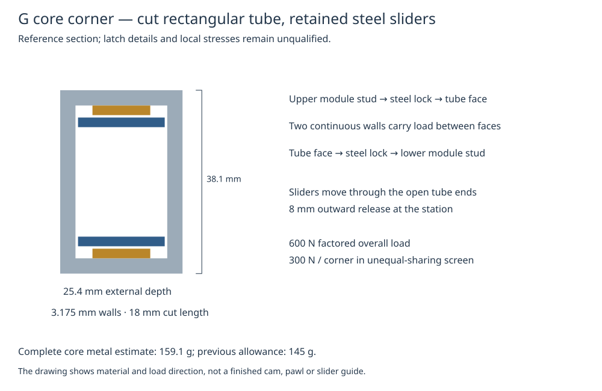

# Core frame and module joints — revision G candidate

The later [I height/mounting candidate](HEIGHT_AND_CASTER_LAYOUT.md) resolves
the sampled height conflict with a different lidar and connector layout. It
preserves this frame's mechanical seat locations; connector mating still changes.

Follow-up: the [H wheel/caster support study](FLOOR_SUPPORT_DESIGN.md) adds
mechanisms and load checks while retaining G's complete mass accounting. Its
proposed droop exceeds 180 mm in some modeled support poses. The 179.1 mm height
below is the nominal pose, not a verified full suspension envelope.

The next mechanical candidate uses **four short sections of rectangular aluminum
tube at the core corners**, connected by aluminum strips standing on edge. Each
tube connects the upper and lower module seats through continuous metal walls.
This replaces the earlier frame allowance with dimensioned stock and a first
load calculation.

The result is **159 g for the core metal frame and mounting hardware**, compared
with the previous 145 g allowance. That adds about **14 g** to each complete
configuration. This pass does not establish a weight saving. The 160 g printed
trays/ribs and 130 g locking-mechanism budgets remain; neither has been reduced
without a complete replacement design.

Start with the [generated design report](../design/system/output/frame_joints.md),
[corner section drawing](../design/system/output/frame_joints.svg), or
[core-only FreeCAD model](../design/system/output/frame_joints_core.FCStd).
The [editable inputs](../config/frame_joints.json) and
[core hardware ledger](../design/system/output/frame_joints_hardware.csv) include
stock sizes, fasteners, assumptions and mass accounting.



The corner stock reference is a 25.4 × 38.1 mm rectangular tube with 3.175 mm
walls, cut into four 18 mm lengths. It uses crosscuts and drilled holes; there is
no longitudinal slot or machined central block. Existing drill-press capability
is useful. A metal-cutting saw/vice or supplier-cut stock, countersink and the
steel-slider cutting method remain to arrange before fabrication.

The steel sliders are 20 × 18 × 2 mm, with an 8 mm outward stroke. The complete
stroke stays inside the nominal 275 mm width. Metal bearing pads keep the
sliders clear of the assumed tube corner radius under load. Actual stock radii,
keeper/guide construction, positive pawls, springs, wear and fastener clearances
remain to qualify; the CAD is not a released latch.

The inherited **600 N factored axial requirement** is retained. Calculations
check four-way load sharing and a 300 N per-corner case for unequal sharing.
The 3.175 mm wall passes the simplified bending screen; the thinner alternatives
in the report fail that screen. These calculations do not establish fatigue life,
local hole strength, joint retention or safe flight.

The top seat rises from 123 to **124.1 mm**. Upper core components rise 1.1 mm,
bringing the modeled overall ground height to **179.1 mm**. The top mounting
fixture and station mating datum must use the new height; previous top-seat
fixtures cannot be assumed interchangeable.

Small placement changes clear the rails and sliders. The Pi and pack-protection
bays move inward, while the rear bins/filter bay gain left-side clearance. The
filter element retains its full size. The vacuum, mop and sofa capacity targets
remain **500, 350 and 300 mL** respectively. They pass the declared wall/reserve
volume screen, but the mop and sofa margins are small: detailed ports, baffles,
seals and evacuation geometry must preserve those capacities.

The shared floor-power bridge now has a clear replacement route after splitting
the controller/supervisor carriers and moving the full sofa feed-drive bay 5 mm
forward. **The existing F carrier remains installed and fully counted.** The
replacement bridge's fixed wheel-pivot and caster-support attachments still need
design before we remove those supports or credit their mass. This distinction
keeps the weight estimate honest while preparing the next chassis layout.

| Complete loaded configuration | G nominal estimate |
|---|---:|
| Vacuum/drive + cap | 4.777 kg |
| Mop/drive + cap | 4.491 kg |
| Sofa vacuum/drive + cap | 5.056 kg |
| Airborne duster + four-propeller reference top | 5.017 kg |

G inherits the power partition from [revision F](CORE_POWER_PARTITION.md) and
the duster mechanism from [revision E](AIRBORNE_DUSTING.md). The older outputs
remain comparison evidence. The battery, cleaning payloads, guards, sensor count,
electrical loads and mission reserves are unchanged. Flight remains unqualified.

CAD allocations, each with a same-named STEP file:

- [Core frame and sliders](../design/system/output/frame_joints_core.FCStd).
- [Vacuum configuration](../design/system/output/frame_joints.FCStd).
- [Mop configuration](../design/system/output/frame_joints_mop.FCStd).
- [Sofa configuration](../design/system/output/frame_joints_low.FCStd).
- [Airborne duster](../design/system/output/frame_joints_duster.FCStd).

Reproduce from the repository root:

```sh
python3 design/system/frame_joints.py
python3 -m unittest discover -s design/system -p 'test_*.py' -q
freecadcmd design/system/export_frame_joints_freecad.py
```

See the [verification record](../design/system/output/frame_joints_validation.md)
for what was checked and what remains untested. No purchase or print is needed
for this review. The next chassis task is the fixed suspension-pivot brackets,
caster bridge and their connections to the module seats.
