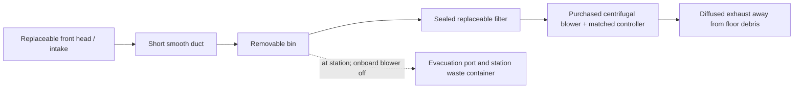

# Ground modules: core, vacuum and cap

> **Sofa update, 2026-09-14:** the [resident attachment comparison](SOFA_ATTACHMENT.md)
> supersedes the dedicated-sofa recommendation below as the direction to develop.
> One extension stays at each floor dock; the ordinary vacuum shares its drives,
> bin, filter and blower, and carries only its retained interface during flight.

> **Scope update, 2026-09-13:** [Whole-system design](SYSTEM_DESIGN.md) now controls
> cross-module layout, carried mass, lift sizing and battery decisions. This
> earlier study remains supporting evidence; its lift deferral or battery-first
> recommendation, where present, is superseded.

**Current follow-up:** the [next vacuum-module pass](VACUUM_MODULE_NEXT_PASS.md)
records the ordered drivetrain and revises the head/bin/air-path proposal for
72 mm wheels and 4–10 mm floor transitions. The
[cassette plan](VACUUM_CASSETTE_PLAN.md) defines replaceable heads and the first
TriCut/plain-brush comparison. Inventory-based placements below remain historical
references where they differ from these follow-ups.

2026-09-05. **Current design phase.** The owner has deferred propulsion selection,
lift sizing, fan testing and the EDF stand until the other modules are designed
and their carried masses are known. Whole-assembly lift remains a later requirement.
This document supersedes the earlier concept's ground packaging and work order.
It specifies the arrangement and interface responsibilities. The first
[dimensioned placement](GROUND_PLACEMENT.md) now provides proposed envelopes,
service paths and joint zones; electrical ratings and fabrication drawings are
not released yet.

## Current overall envelope

The compact [placement](GROUND_PLACEMENT.md) uses a **275 × 275 mm rigid body
including wheels, with a 180 mm total height limit including LiDAR**. Flexible
bristles may extend, explicitly confirmed by the owner. The modeled height is
178 mm. Main panels target whole 270 × 270 mm prints; actual toolpaths and
structural sections remain to check. This replaces earlier larger packaging.

## Packaging constraint: 50 mm beneath sofas

The owner reports a couple of sofas with approximately **50 mm clearance**. The
earlier robot does not fit: its 70 mm wheels alone exceed the gap, and its complete
cap configuration was 190 mm tall.

**Owner-confirmed approach:** the main robot stays outside while an automatically
deployed low cleaning head reaches underneath. The bin, blower and electronics
remain on the main chassis. The 50 mm requirement applies to everything entering
the gap; it does not require the entire three-part robot to be that low.

The owner also suggested a separate module or attachment. Use a
[dedicated low-clearance bottom](LOW_CLEARANCE_HEAD.md) as the working design,
with its own wheels, head, bin/filter/blower and local controls. It shares the core
interface with the everyday vacuum, so the station swaps complete bottoms.

The sofas are approximately **36 inches (914.4 mm) deep and approachable only from
the front**. This calls for roughly that much coverage beyond the sofa edge, plus
robot stand-off. The long-reach mechanism is separate from the everyday vacuum.

For a reaching-head study, use **40 mm maximum moving height** as an initial
target, leaving 10 mm against the reported gap. This is a proposed allowance, not
a measured margin. The head must retract for docking and transport, detect
obstructions and stop rather than pull the robot into furniture. Do not assume a
short nozzle cleans the whole sofa footprint. Package the core and everyday
vacuum independently of the extension internals. The dedicated bottom will declare
its own stowed and deployed outlines for station storage and navigation.

The owner explicitly permits replacement parts when size, weight or performance
improves. Current owned components are references; compare the complete installed
air system and support hardware before fixing their surrounding structure.
See [replacement priorities](OWNED_PARTS_REUSE.md).

## Core construction

Use a perimeter frame with replaceable equipment trays. Arrange battery and
electronics **beside one another within the core**, to reduce core height.
Place the battery near the drive support area once wheel locations are established.

| Core assembly | Construction and access proposed for CAD |
|---|---|
| Structural perimeter | Whole main panels and separate frame members joined with through-bolts, metal spacers and load-spreading washers/strips; keep passive rear tool pockets open. Top and bottom mating faces connect through this frame; removable panels do not carry primary retention loads. |
| Battery tray | Withdraws through a side service opening with both robot modules attached. Replaceable tray and restraint accommodate inventory substitutions. Final pack, protection and charger remain to select. |
| Power tray | Near the battery, with separately protected logic, bottom actuator and cap branches; current measurement, temperature sensing and accessible isolation. |
| Logic tray | Local supervisory MCU and replaceable navigation-computer carrier. Include cooling and connector bend space. Local motion protection remains available if the computer or network fails. |
| Sensors | Replaceable outward-facing core brackets; floor-facing sensors belong to the bottom. A LiDAR needs an unobstructed scan plane. The main body stays outside the 50 mm sofa gap; other route clearances still govern its sensor envelope. |
| Station pickup points | Two side-accessible support rails/saddles attached to the perimeter and positively captured by the station. Accessible with either bottom and either top attached. |

The core has **no wheels, dirt bin or water circuit**. The bottom-owned filter,
plenum, blower and exhaust project upward into passive openings in the core frame
to reduce total height. They lower out with the bottom. The frame links both mating
faces around these openings while trays remain replaceable. Ground prototype joints are not qualified
to suspend the robot in flight; top load capability remains unresolved.

## Shared bottom chassis and vacuum layout

Each finished interchangeable bottom has a complete drivetrain and local
controller. Reuse the same chassis design across vacuum, mop and duster bottoms;
automatic tool changes must not require manually transferring motors.

Use two encoder-equipped drive wheels, protected axle ends and compliant support
contacts. Put the everyday cleaning head ahead of the wheels so it encounters
debris before the tires. Keep wiring and wheel service outside the dirt path.
Wheel diameter, ratio and support positions follow ground clearance, packaging
and cleaning-head drag; use the owned 60 mm wheels as the compact layout reference, with owner-reported 8 mm width, 3 mm bore and no hub protrusion. Selected motor-adapter fit remains open. The chassis
stays outside the 50 mm sofa gap.

Follow the [hair-priority recommendation](VACUUM_RECOMMENDATION_REVIEW.md) and
[cassette plan](VACUUM_CASSETTE_PLAN.md): investigate TriCut with a matching Dreame
plain roller as the first comparison. Use a removable guard for compatible
roller changes and exchange the complete head, including its drive and intake,
for different architectures. Keep the receiver, bin, filter and blower shared.
The [owned consumables](VACUUM_HEAD.md) are alternatives, not mandatory geometry.
These internal service parts do not replace the full bottom interface.
The reaching mechanism belongs to the separate low-clearance bottom,
not the everyday vacuum. Each bottom has its own suction path; the everyday
vacuum needs no extension-inlet selector or internal guide/duct storage bay.

Place the bin downstream of the head with minimal bends, then the filter and
blower in a clean-air compartment. Withdraw the bin without removing the core.
Hair must not pass through the blower impeller. Use removable hair shields at
roller bearings and avoid exposed axles. Pickup and wrap resistance need verification.

Target **0.5–0.6 L usable debris capacity** in the compact layout, with a proposed
0.844 L clear cavity before collection details and freeboard. This is not a measured
hair capacity or service-interval claim. Frequent automatic emptying may be needed;
measure with actual dog hair.

Provide a downward evacuation door beneath the dirt well. Station suction and an intentional make-up
air path sweep the bin while isolating the onboard blower from reverse flow.
Check packed-hair bridging and sealing on the actual bin. Emptying air stays out
of the electronics core. The compact side brush sits behind the left wheel and
feeds a separate gated inlet into the dirt well. It cannot feed the front rollers
after they have passed; suction sharing and pickup need testing.

## Interface arrangement

Separate the three sections vertically. Use a common family of perimeter features,
with different top/bottom keys. The [placement study](GROUND_PLACEMENT.md) now
assigns three corner zones and a rear bridge zone for the bottom, four corner
zones for the top, and connector pockets; detailed mating
geometry remains open.

| Feature | Arrangement and purpose |
|---|---|
| Compression seats | Broad perimeter seats carry operating weight without loading electrical plugs. |
| Registration | Tapered lead-ins followed by a round locator and slotted locator guide the mate while accommodating manufacturing variation. |
| Retention | Four replaceable latch zones per interface; bottom rear-right moves inboard above the bin to avoid the blower. Provide side/rear release access and a bridge clear of the drawer path. Station actuators operate mechanical locks that retain without continuous power. |
| First retention prototype | Captive nuts and through-bolts in the cassette locations, preserving automatic latch space/release paths. Manual bolts are a development step only. |
| Electrical mate | Recessed floating connector carrier, separated from dirty/wet service ports. Guides take alignment loads before contacts engage. The frame carries structural loads. |
| Detection | Separate seated and locked indications plus module identity. An actuator endstop alone does not demonstrate retention. |
| Station access | Side core supports; bottom exits downward onto a supported tray, clearing wheels, sensors and any retracted head. |

Design latch cassette, connector and station support together before releasing a
chassis. Start with a small joint sample using printed guides and ordinary
fasteners; this fit work does not require the EDF shaft/bearing harness.

### Power and data

Reserve functions for actuator supply/return, current-limited module logic
supply/return, CAN high/low, hardware actuator enable and identity/presence detection.
This is a functional allocation, **not a connector pinout**. Logic power allows
identification before enabling motors. Supply ranges, contacts, grounding,
termination, mating sequence and protection remain to design.

Keep the owned **Zeee 3S 5200 mAh** pack as the current ground-development
candidate in a removable tray. Its stated 11.1 V is nominal, not regulated.
The earlier 4S discussion concerned the EDF, whose selection/testing is deferred;
it did not establish a 4S ground-robot requirement. The future lift power
interface remains unselected.

| Standard LiPo comparison at 5.2 Ah | 3S, owned | 4S, hypothetical |
|---|---:|---:|
| Nominal voltage | 11.1 V | 14.8 V |
| Fully charged voltage | 12.6 V | 16.8 V |
| Calculated nominal energy (`V × Ah`) | 57.7 Wh | 77.0 Wh |

The extra cell gives 33% more nominal energy at equal Ah, with additional cell
mass and volume; this is not a measured runtime improvement. Compare candidate
packs by Wh, mass, usable discharge range and load capability, not Ah alone.

The owned CBM-979533B-168 has a model-specific **6–12.6 V** input range. A 4S
pack would require an appropriately rated regulated supply for this blower;
power/ground PWM is explicitly prohibited by its manufacturer. Even on 3S,
protect against supply transients and observe battery discharge limits rather
than treating the blower's 6 V minimum as a pack cutoff.
[CBM-97B datasheet, pp. 1 and 6](https://www.sameskydevices.com/product/resource/cbm-97b.pdf)

A possible reason to choose 4S later is maintaining a regulated 12 V blower rail
with a step-down converter over the intended battery range. Allow for regulator
dropout and pack sag. Holding 12 V on 3S also requires step-up capability as the
pack voltage falls. Regulator sizing must include blower startup, cooling and
losses; no converter or new battery has been selected. The recommended 12 V drive
motors do not require a 4S pack. If the motor branch changes to 4S, design voltage
and current limits plus braking-energy handling instead of applying unrestricted
pack voltage. [Motor voltage guidance](https://www.pololu.com/product/4847),
[step-down regulator/dropout explanation](https://www.pololu.com/product/4095)

Choose the final pack and rails after estimating the ground loads and establishing
whether blower voltage variation materially affects pickup. Retain replaceable
battery/power trays. Automatic dock charging, cell balancing, temperature sensing
and pack protection remain separate design work for either cell count.

### Owned hardware for the first layout

The [owned-parts assessment](OWNED_PARTS_REUSE.md) and
[inventory record](../config/owned_parts.json) establish the reuse options.
The [drive motor comparison](DRIVE_MOTOR_OPTIONS.md) now recommends a faster
Pololu 25D HP encoder pair for the long-term drive, subject to load and layout.
The owned scanner and blower replace the C1 and Wonsmart shopping references.

| Function | First reuse choice | Remaining design work |
|---|---|---|
| Navigation | Owned Pi 4 plus RPLIDAR A1; Pi 5 remains an alternative | Regulated supply, cooling, scanner revision/interface and clear scan plane |
| Drive | Owned unidentified 60 mm wheels; 25D HP 12 V 75:1 encoder pair is the leading long-term candidate; owned 18 RPM pair remains an optional prototype set | Replaceable motor plates; verify hub fit, loaded torque/current and encoder voltage interface; replacement not ordered |
| Vacuum air | Owned CBM-979533B-168 after bin/filter | Wide low-restriction air path; verify pickup with loaded filter and startup/power behavior |
| Servo tasks | Owned PCA9685 board or Waveshare HAT | Choose one for a defined actuator; confirm board and servo supply limits |
| Local motion control | Microcontroller(s) and dual brushed-motor driver must be purchased | ESP32-DevKitC V4 and Cytron MDD10A are layout candidates; full BOM still includes power, protection, wiring and sensors |

The CBM blower uses two-wire DC and does not need an aircraft ESC or external
commutation driver. Its manufacturer disallows power/ground PWM speed control;
use a suitable protected DC on/off branch. A 12 V motor label is not a complete
operating-range specification. Final branch ratings, encoder levels and the
Waveshare HAT revision remain to verify before wiring.

### Automatic exchange

1. Dock and stop cleaning. The station captures/supports the core and supports the
   bottom on its tray, keeping local control powered.
2. Disable the bottom actuator branch and verify it is off. Isolate contacts as
   required by the selected connector before separation.
3. Release retention only after support is confirmed. Lower the bottom 50 mm to clear
   its 37 mm projection into the core; then transfer the tray rearward. The current
   tray-top proposal lowers from 60 to 10 mm above floor, leaving 13 mm separation.
4. Bring in the replacement, raise onto guides/seats and lock it.
5. Verify seating, retention, identity, voltage compatibility and local health
   before enabling actuators. Withdraw supports only after successful checks.

Interrupted exchanges leave both sections captured. Develop one docking bay and
exchange position before a full storage cabinet. Preserve access for later cap
handling, charging and bulk service. Both floors eventually need compatible
stations; the earlier flight-top cabinet dimensions are not a current build target.

## Other modules

| Module | Task hardware | Shared interface |
|---|---|---|
| Cap | Cover; optional status light/display | Top registration/retention and low-power connection; central control stays in the core. |
| Low-clearance bottom | Floor-supported extending head, duct, bin/filter/blower and retrieval mechanism | Complete wheeled bottom, same core mate and supported automatic exchange; module-specific stowed/deployed outlines. |
| Mop bottom | Pad drive/lift, bounded water reservoir, dosing pump and contained plumbing | Complete wheeled chassis, core mate and module protocol. Pad lifts for travel/docking. Fill/drain and pad service occur at the station. |
| Duster bottom | Dry replaceable head and collection path as appropriate | Same bottom interface; any deployment is local. High-area positioning stays deferred with lift work. |

Mopping follows a working vacuum. Establish metering, pad wetness, leakage and
drying on representative wood/tile. Manual bulk reservoir/waste service is
accepted; manually fitting tools or extending heads is not the final operating
model. Cleaning, charging and swaps remain fully automatic goals.

## Mass evidence and build sequence

### First dimensioned ground layout

**Placement delivered, 2026-09-06:** see the
[full assembly viewer](../design/ground/output/ground_layout.html) and
[placement decisions](GROUND_PLACEMENT.md). The 275 × 275 × 178 mm proposal includes
side-access core trays, a rear-service bin/filter drawer, upright blower in passive
core openings, a rear bridge joint zone and 50 mm station separation stroke. The next detailing work is
the joint sample and powered head, with a consolidated fit/parts review before
ordering. The scope below remains the basis for this work.

2026-09-06. Develop the core, cap and everyday vacuum bottom together. Use the
owned 3S pack, Pi 4, A1 and CBM blower with 60 mm wheels as working references;
the Pololu 25D HP 12 V 75:1 encoder pair is a proposed motor envelope, not a
confirmed purchase. Keep unknown owned-part dimensions explicitly provisional.

Start by defining the roller/intake cassette. Its roller, bearings, end supports,
drive and removal path set the front of the bottom and the path into the bin.
Then place the wheel assemblies, bin/filter and blower, followed by the core
trays and shared joints. Account for side service access and station supports
before fixing the chassis outline. Do not freeze the common interface around a
roller alone; also reserve the mop and low-clearance bottoms' service needs.

The next review package should contain:

- Dimensioned top and side layouts, with component and service envelopes.
- A short vacuum air path and bin/filter arrangement for dog hair.
- Joint, connector and station-support locations, with automatic release access.
- A consolidated first-build BOM covering the cleaning-head drive, wheel drive,
  control, power, sensors, mounts, fasteners and wiring; identify selections still
  requiring dimensions or electrical qualification rather than presenting a
  partial order as complete.

After that review, the first print is a small core-to-bottom mating sample to
check alignment, seating and access before committing to the larger chassis.

**Inventory measurements recorded:** The owner reports two complementary roller
styles in both 254 mm and 184.15 mm lengths, and a 136 × 76 × 14 mm filter with a
20 × 6.5 mm pull tab raised roughly 5 mm. Reserve approximately 19 mm local filter
depth at the tab under the interpretation documented in the
[vacuum-head record](VACUUM_HEAD.md), plus service access. Both roller styles now
have a reported diameter of **28 mm**; the initial envelope questions are resolved
in [owned_parts.json](../config/owned_parts.json). The first
[dimensioned cassette clearance study](../design/ground/output/vacuum_head_layout.html)
uses a proposed 30 mm center spacing, 254.15 × 72 mm short-pair footprint and
35 mm roof reference. A side-drive extension reaches 62 mm in the full layout.
These include provisional housing/drive allowances, not a completed powered head.
The short cassette targets a whole print. The 324 mm long-pair comparison exceeds
the new body-width limit.

### Mass records and subsequent builds

Use [ground_components.csv](../config/ground_components.csv) for component evidence
and [ground_assemblies.csv](../config/ground_assemblies.csv) for complete-module
weighings. Blank measured fields mean **unknown**, never zero. The old 4.22 kg
flight estimate is not a ground-build measurement.

Weigh the core with actual battery, wiring and both mating faces; weigh the cap
separately. Record each bottom empty and at its maximum permitted operating load,
including debris, water and wet pads. Assign each joint half to its carried section.
Assembly masses are cross-checks, not extra components to add again. Use the owned
2 kg scale for smaller subassemblies within its capacity, with no weight supported
by the surrounding bench. A missing whole-module reading stays blank.

1. **Lay out core, cap and everyday vacuum.** Include actual component envelopes,
   service paths, airflow, wiring and joint cassettes. Keep the separate long-reach
   mechanism out of this first bottom. Publish the dimensioned layout and
   consolidated parts list together.
2. **Print a mating sample, then a serviceable core, cap and rolling vacuum
   chassis.** Target whole 270 × 270 mm main panels on the TAZ 6; check print margins and flatness. Reuse the parts in the working
   robot; temporary manual assembly serves fit checks only.
3. **Drive and collect hair on wood/tile.** Record pickup from known debris loads,
   remaining/wrapped hair, time, filter loading, current, temperature and floor
   marking using the actual module. No separate elaborate test stand is proposed.
4. **Demonstrate core support and automatic bottom exchange**, then integrate
   charging, emptying and floor navigation. Develop the dedicated low-clearance,
   mop and duster bottoms against the same interface with their own envelopes and
   operating-load measurements.

Resume lift design once the core and intended bottoms have established dimensions
and measured carried masses. Later add the lift hardware and any battery/power
changes to that payload. Preserve editable interfaces; ground progress does not
promise the eventual flight budgets will close.
