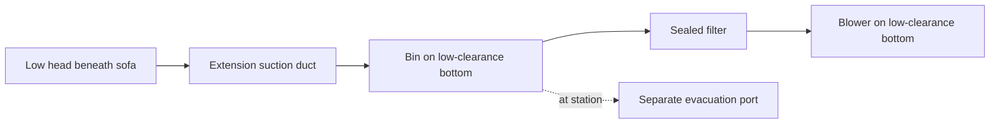

# Dedicated bottom for low furniture

> **Direction update, 2026-09-14:** investigate the [shared sofa attachment](SOFA_ATTACHMENT.md)
> as the preferred candidate. The owner confirmed a duplicate extension at each
> floor dock, so only the normal vacuum/core/battery and retained interface fly.
> It replaces the complete powered head, sharing the vacuum drivetrain and air
> system. The dedicated bottom below is preserved as the prior comparison.

> **Scope update, 2026-09-13:** [Whole-system design](SYSTEM_DESIGN.md) now controls
> cross-module layout, carried mass, lift sizing and battery decisions. This
> earlier study remains supporting evidence; its lift deferral or battery-first
> recommendation, where present, is superseded.

2026-09-05. The owner wants a cleaning head to enter the **50 mm sofa gap** while
the main robot stays outside, and suggested making this a separate module or
attachment. The sofas are approximately **36 inches (914.4 mm) deep**, with access
**from the front only**.

Adopt a **dedicated low-clearance vacuum bottom** as the working design. It uses
the same core interface as the everyday vacuum and mop bottoms. This keeps the
long-reach mechanism out of the everyday vacuum and leaves the core layout free
of its internal storage needs. The mechanism and its hardware are not yet selected;
this is an interface and reach brief, not fabrication CAD.

## Module boundary

| Assembly | Contents |
|---|---|
| Shared middle core | Battery, power distribution, central logic and navigation sensors |
| Everyday vacuum bottom | Its own wheels, local controller, normal powered roller, bin, filter and blower |
| Low-clearance vacuum bottom | Its own wheels, local controller, extending head, guide/drive, duct, bin, filter and blower |
| Top cap | Remains fitted for either kind of floor cleaning |

The station exchanges the **complete bottom**. Only one bottom is carried at a
time. Reuse drivetrain, bin, filter and blower designs where useful, but each
finished bottom has its own hardware; changing tools must not require manually
transferring those parts. The low-clearance module's outline may differ from the
ordinary vacuum while sharing its mating interface and station pickup arrangement.

A dock-swapped head attachment could later share one vacuum's wheels/blower and
reduce duplication, but would need another automatic mechanical joint and sealed
air connection. Defer that extra interface for the first design. A complete bottom
fits the existing three-section architecture and automatic station work.

## Reach and height

| Input / target | Value | Basis |
|---|---:|---|
| Sofa underside clearance | Approximately 50 mm | Owner report |
| Front-to-back depth | Approximately 914.4 mm | Owner's 36-inch estimate converted to mm |
| Available approach | Front only | Owner report; no rear approach assumed |
| Initial maximum moving height beneath sofa | 40 mm | Design target including supports, fasteners, guide, duct and fittings entering the gap |
| Coverage required beyond sofa front | Approximately 914.4 mm | Initial full-depth coverage objective; actual legs/underside still require mapping |
| Initial reach envelope from robot nose | About 1,000 mm | Study allowance, not an actuator stroke or guaranteed coverage |

The 40 mm target leaves a nominal 10 mm against the reported gap; sofa sag and
floor variation have not been surveyed. The 1,000 mm reach allowance leaves only
85.6 mm beyond the reported depth for robot stand-off. If the actual stand-off
is larger, the reach target must increase. Head geometry and its retracted position
then determine actuator travel. Do not equate a one-metre actuator with one metre
of useful cleaning coverage.

Front-only access means we cannot halve the depth by approaching from the rear.
Legs can also prevent a straight head from reaching some regions. Navigation must
record inaccessible regions rather than report complete coverage from extension
length alone.

## Cleaning mechanism to study

Use a floor-supported low suction head with a removable passive brush or compliant
lip as the initial head concept. Keep the extension motor on the module body.
This avoids placing a roller drive inside the 40 mm head, but pickup through the
extended duct still needs verification with actual dog hair and a loaded filter.
Revise the head if passive agitation is insufficient. The everyday vacuum retains
its powered, removable rubber-fin roller.

There is one cleaning inlet in this dedicated bottom. The everyday vacuum does
not need an extra inlet selector, extension bay or hose connection. Dirty air
stays within whichever bottom is attached; none passes through the core.

A straight motor-driven telescoping guide is the first mechanism to evaluate.
Support the head on small floor rollers or smooth replaceable skids, with a
compliant connection to follow the floor. The guide positions and retrieves the
head; the hose alone must not push it. A roughly one-metre reach makes guide
stage count, overlap and duct storage substantial design work. Do not claim it
fits the old 200 mm-deep chassis, or order a long linear slide before resolving
its retracted envelope.

Provide extension position feedback and an independent stowed detector. Keep
all moving duct/fittings within the clearance envelope. Compare guided flexible
hose storage with a telescoping duct; hose bend space and sliding-seal leakage
are different packaging costs. The module must store its complete head, guide
and duct before docking or a bottom exchange. The station must accommodate this
module's declared stowed outline, rather than assume every bottom has the same
outer dimensions.

## Operation

1. The station installs the low-clearance bottom using the common supported
   exchange sequence and verifies its identity and retention.
2. With the head stowed, the robot approaches an accessible strip from the front,
   aligns and holds position while the head extends and retracts to clean.
3. Retract before turning or moving sideways to the next strip. The wheeled
   chassis provides repositioning; the initial head has one extension axis.
4. Stop extension on obstruction. Withdraw only when the return path is clear;
   persistent entrapment stops the job and requests assistance. Keep the main
   bumper and pet/obstacle detection active while the robot waits outside.
5. Verify full retraction before travel, docking or module exchange. The station
   can restore the everyday vacuum bottom for the next task.

## Relationship to the current build

**Continue the core, cap and everyday vacuum first.** Develop the common mating
joint and station supports with room for different bottom outlines. A one-metre
head mechanism is not a prerequisite for the first rolling vacuum, and does not
set the core's height or require an extension bay in the everyday vacuum.

During the dedicated bottom's detail design, publish deployed/retracted envelopes,
actuator travel, guide support, duct storage and coverage around sofa legs together
with a consolidated hardware list. Include its complete dry and loaded mass in
[the assembly record](../config/ground_assemblies.csv). Do not add its hardware to
the ordinary vacuum's carried mass. Lift work remains deferred until the other
modules and their operating loads are established.

Both clarification questions are answered: the main robot stays outside, and the
sofas require front-only access across approximately 36 inches of depth. Detailed
leg/underside geometry is a later mapping input, not another question blocking
core and everyday-vacuum design now.
