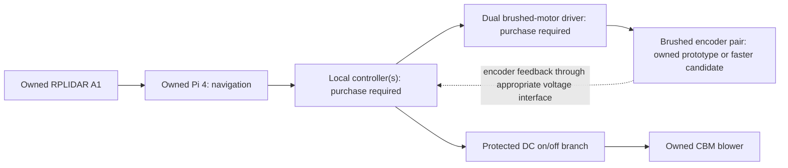

# Owned parts: first ground build

2026-09-05. Use the owner's inventory to replace earlier shopping references.
The working combination is **Pi 4 + RPLIDAR A1 + 60 mm wheel reference** and the CBM blower.
The two owned GA25-371N 12 V / 18 RPM encoder motors are available for a slow
prototype. The owner wants faster long-term alternatives; the
[motor comparison](DRIVE_MOTOR_OPTIONS.md) recommends Pololu 25D HP encoder
motors as the leading candidate. No brushed H-bridge or standalone MCU is on hand.
Update 2026-09-06: **two B-G431B-ESC1 controllers are purchased and awaiting
delivery** for the separate BDUAV rolling rig; each includes an MCU and ST-LINK.
The owner explicitly permits different parts when installed size, mass or performance
warrants them. Reuse is a starting preference; it does not fix component choices.
This is a reuse assessment, not a released wiring diagram or purchase list.

[owned_parts.json](../config/owned_parts.json) records ownership, assignments,
unknown variants and resolved questions. Stock counts remain unknown except
where explicitly reported; measured masses are still unknown. [ground_components.csv](../config/ground_components.csv)
lists parts needed for each assembly; its quantities are requirements, not a count
of available stock. Alternative Pis and station boards are not all installed on
the robot or added to its carried mass.

## Assignments

| Owned item | Proposed use | What remains to establish |
|---|---|---|
| SLAMTEC RPLIDAR A1 | First core-mounted floor-navigation scanner; replaces the C1 shopping reference | Exact A1 revision, supplied interface/cable and mount geometry |
| Raspberry Pi 4 | First navigation computer in a removable core tray | RAM, storage/cooling and performance with the actual navigation workload |
| Raspberry Pi 5 | Interchangeable compute alternative if vision/planning needs it | Recheck cooling, connector access and supply capacity when substituted |
| Raspberry Pi Zero 2 W | Candidate station communications/job interface | Local station motion/retention still needs independent control; no reason to carry all three Pis |
| Pololu 90 × 10 mm wheels | Larger alternative; replaced by 60 mm reference in compact layout | Exact hub variant, matching adapters and available quantity |
| Unidentified 60 × 8 mm wheels | Current reference; 3 mm center hole and no hub protrusion owner-confirmed | Exact hole/recess profile, face-hole spacing, selected adapter, tire, quantity and mass |
| Pictured passive ball casters | Owner reports 28 × 45 mm plate, 13 mm overall height, 3 mm mount height; reserve candidate | Exceeds current 20 mm support bay; mounting datum, load, quantity and floor behavior unresolved |
| GA25-371 motors, originally reported as GA25-371N | Two owned: 12 V, 18 RPM, encoders, D shafts; optional slow prototype or reserve | Faster long-term alternatives in the motor comparison; owned shaft, mounting, encoder and current details remain unknown |
| CBM-979533B-168 | Initial filtered, roller-assisted vacuum blower | Actual pickup with the chosen duct/filter, startup load and supply conditioning |
| Vacuum consumables, initial link Amazon B088W8HS1Y | Owner reports s9/s9+ parts; complementary styles in 254 × 28 mm and 184.15 × 28 mm sets; filter body 136 × 76 × 14 mm | End geometry and filter tab placement; drive hardware still to select; see [vacuum head](VACUUM_HEAD.md) |
| PCA9685 board | Servo signal generation for station handling or a later cleaning actuator | Board voltage ratings, actuator power supply and enable behavior |
| Waveshare Servo Driver HAT | Alternative to the loose PCA9685 board for a compatible servo task | Exact HAT revision, its regulator limits and any shared Pi power connections |
| BDUAV 2204-260KV motors | Physical label and direct M2 rotor-to-wheel attachment confirmed; drive candidate | Conflicting purchase-page sheet; actual ratings/mass, sustained torque, feedback and wheel-bearing loads |
| Four iFlight 2750 KV motors | Reserve inventory; XING-E Pro 2207 working family identification | Exact physical model/revision, mass, condition and application-specific torque/thermal performance; not selected for the rolling rig |
| Two ST B-G431B-ESC1 controllers, purchased but not received | Selected for the BDUAV rolling rig; one MCU and power stage per wheel | External encoder fitting, custom firmware, low-current calibration and actual drive results; see [preparation](../design/experiments/drive_rig/PREPARATION.md) |

The HAT and loose PWM board overlap in function. Allocate one where needed instead
of installing both by default. A Linux Pi and a PWM expander do not by themselves
provide encoder feedback loops, brushed-motor power switching or a command-loss
watchdog. The purchased ST boards cover the rolling rig's MCU and brushless power
stages; its feedback and shutdown firmware still needs implementation. A brushed
gearmotor bottom would need its own compatible driver and controller.

## Changes to core packaging and power

Start with the Pi 4, with separate battery and compute trays and room to change
the computer carrier. Raspberry Pi recommends a 5 V/3 A supply for Pi 4 and a
5 V/5 A supply for Pi 5; a Pi 5 on 3 A limits USB peripheral current to 600 mA.
These are supply requirements, not constant operating consumption. Account for
peripherals and cooling separately. [Raspberry Pi power documentation](https://www.raspberrypi.com/documentation/computers/raspberry-pi.html#power-supply)

The A1M8 reference is approximately 96.8 × 70.3 × 55 mm and 170 g, larger than the
earlier C1 reference. Mount to the core with a clear scan plane and a cap opening
that permits top removal without unplugging the scanner. Its single scan plane
does not replace floor cliff sensors, bumpers or detection of objects below/above
that plane. [SLAMTEC family dimensions](https://www.slamtec.com/cn/lidar/a1spec)

Use the actual revision's electrical specification. The A1M8 v3.0 datasheet lists
300 mA typical scanner working current, 500 mA typical/600 mA maximum scanner
startup current, and about 100 mA typical motor current at 5 V. Do not budget the
whole spinning scanner as the product summary's 100 mA. Preserve scanner/motor
power separation or use the appropriate development adapter. [A1M8 datasheet, pp. 10–12](https://wiki.slamtec.com/download/attachments/83066883/LD108_SLAMTEC_rplidar_datasheet_A1M8_v3.0_en.pdf?api=v2&modificationDate=1677786044000&version=1)

The original Waveshare HAT manual specifies 6–12 V input and up to 3 A from its
5 V regulator. A fully charged 3S LiPo is 12.6 V, beyond that stated input range.
Until the exact board revision is identified, do not connect it directly to the
pack or count its regulator as the combined Pi/servo supply. [Waveshare manual](https://files.waveshare.com/upload/1/1b/Servo_Driver_HAT_User_Manual_EN.pdf)

## Wheel and motor fit

The standard Pololu 90 × 10 mm D-shaft wheel has a **3 mm bore** and mounting holes
for universal hubs; a servo-spline version also exists. If the owned motor shaft
is larger, choose a matching bolt-on hub rather than forcing the wheel onto it.
Check the owner's exact wheel version. [Pololu wheel and hub compatibility](https://www.pololu.com/product/1435)

At 90 mm diameter, wheel travel is `pi × 0.09 = 0.2827 m/revolution`.
The owner has two matching **12 V / 18 RPM encoder motors with D shafts**. At the
listed speed, travel is `pi × 0.09 × 18 / 60 = 0.0848 m/s` (about 8.5 cm/s).
Actual loaded speed is unmeasured; the listing does not establish whether 18 RPM
is a no-load or rated-load value. This is below the proposed 0.15–0.25 m/s cleaning
range. The owner has now asked for faster long-term alternatives: use the
[documented motor comparison](DRIVE_MOTOR_OPTIONS.md) for that selection and
keep this pair available for prototype work. Changeable motor plates preserve
both options; the whole GA25 family is not ruled out by this variant's speed.

The provided listing says GA25-371; the earlier message said GA25-371N. No reliable
exact manufacturer specification was found. Record voltage, RPM and encoders as
owner-supplied specifications; leave shaft diameter, gearing ratio, current ratings,
encoder voltage/counts, dimensions and mass unknown. Do not infer torque from the
low speed or copy figures from a similarly named motor.

Use replaceable motor plates and allow room for hubs, encoder wiring and axle hair
shields. Both wheel choices keep the main chassis outside the sofa gap. The compact layout
uses owner-reported 60 × 8 mm wheels; hub and support geometry must be confirmed
before releasing motor plates.

### Owned 60 mm wheels: current compact reference

The owner reports **60 mm diameter and 8 mm width**; no model number is known.
Do not assume Pololu construction, a 3 mm D bore or the same tread as the 90 mm
wheels. The owner now confirms a **3 mm center hole and no hub protrusion**, plus
face holes that work with the BDUAV motor. Exact hole/recess profile, bolt spacing
and the chosen gearmotor adapter remain to establish. The owner now confirms
that the BDUAV matching face rotates and accepts the wheel directly with M2 bolts;
this option needs no separate wheel hub. With wheel centers unchanged, reducing the
former 10 mm allowance to 8 mm adds 1 mm clearance at each face of each tire.
The wheel remains 8 mm wide; a separate motor adapter can add installed width.
Its offset and tire load rating remain unqualified.

| Wheel diameter | Travel per revolution | Calculated speed at 18 RPM |
|---|---:|---:|
| 90 mm | 0.283 m | 0.0848 m/s (8.5 cm/s) |
| 60 mm | 0.188 m | 0.0565 m/s (5.7 cm/s) |

These are geometric comparisons at equal wheel RPM, not loaded measurements.
The 60 mm wheel has two-thirds the travel per revolution and, ideally, 1.5 times
the tangential force at equal axle torque (`F = torque / radius`). Actual grip,
motor loading and floor performance still depend on the complete drivetrain.
Its smaller envelope may help packaging, but chassis height and ground clearance
also depend on where the axles are mounted.

Use the 60 × 8 mm pair for the 275 mm compact layout. Retain the 90 mm pair as an
alternative. The Pololu
75:1 #4846 motor is the current replacement reference for the smaller wheels;
loaded speed, torque and hub fit remain to qualify. Count only the installed set
in each bottom's mass; no wheel purchase is proposed.

## Pictured passive ball casters

Owner photographs dated 2026-09-06 show an exposed metallic-looking ball in a
pale housing, a two-hole flange and black backing. This identifies the general
ball-caster form, not its manufacturer, alloy or load rating. The owner now
reports a **28 × 45 mm mounting plate, 13 mm overall height and 3 mm mount
height**. Record the 3 mm as a provisional flange-thickness interpretation within
the 13 mm overall envelope, not an additional 3 mm or a floor-contact datum.
The plate exceeds the current 20 × 20 mm reservation in either axial orientation;
13 mm overall height fits its vertical allowance. A revised mount/placement is
needed before using it. This does not mean it cannot fit elsewhere in the robot.

Ball casters can provide the third contact point of a differential-drive robot
and roll in arbitrary horizontal directions. Pololu describes this application
for its own small-robot casters; its ratings do not apply to these unidentified
parts. [Manufacturer category reference](https://www.pololu.com/category/45/pololu-ball-casters)

For this home's wood/tile and dog hair, the design preference is a small swivel
caster with a soft, non-marking tread, shielded axle and easy removal for cleaning.
Blickle documents floor-preserving, non-marking rubber and polyurethane tread
options; this supports a material preference, not a guarantee that any particular
caster fits or will leave the owner's finish untouched.
[Tread material guide](https://www.blickle.us/en-us/guide/material-description-wheel-treads)

The exposed ball's concentrated contact and possible grit/hair ingress are
engineering concerns, not observed failures of the owned part. A soft-tread
caster also needs hair clearance and loaded rolling checks. Keep the pictured
parts as candidates for controlled bench supports or station guide mechanisms,
subject to mounting orientation and load qualification. No station load capacity
is inferred, and the casters are not added to the current carried mass.

## Component replacement priorities

The owner's explicit direction is to consider replacements for parts that are too
heavy, large or underpowered. Compare complete installed assemblies, including
mounts, regulators, wiring and cleaning performance; catalog dimensions alone
can shift bulk into another subsystem. Preserve the 275 × 275 × 180 mm ground
constraints while evaluating alternatives. Propulsion remains deferred.

| Component | Current assessment | Replacement comparison before final detail |
|---|---|---|
| 60 × 8 mm drive wheels | Useful compact reference; no dimensional reason to discard them | Hub compatibility, tire grip and floor behavior; loaded speed/torque still govern motor choice |
| Passive support | Owned 28 × 45 mm flange exceeds the current 20 mm reservation; 13 mm height is compact | Soft-tread swivel caster with published dimensions/load, hair access and suitable installed height; revise support placement if needed |
| CBM blower and filter arrangement | Reuse candidate; upright placement requires core openings and limits bin/electronics space | High priority: compare a compact vacuum blower with a published pressure-flow curve, matched filter and complete installed power/mass; dog-hair pickup determines adequacy |
| Roller drive and controls | Unselected; tight reserved bays | Fit a serviceable drive, couplers and power stages before releasing the cassette or electronics carriers |

Keep the owned Pi 4, A1 and 3S pack as current references. If alternatives improve
the complete system, document the benefit and consolidated compatible cost before
proposing purchases. No new component or purchase is selected by this update.

### Owner replies recorded

Recorded: wheel center hole 3 mm, no hub protrusion, direct M2 fastening to the
rotating BDUAV face; caster plate 28 × 45 mm, overall height 13 mm, mount height
3 mm. Exact wheel recess/bolt geometry and screw engagement remain later fit details.

The physical motor is confirmed to be marked **BDUAV 2204-260KV**. The newly
attached **ML2206B / 160 RPM/V** sheet came from its purchase page and conflicts
with that label. Retain the image's claims as disputed evidence, without assigning
its 1.3 A, 15 W, 5.6 ohm, 23 g or 28 × 15 mm values to the owned motor.
The [drive assessment](DRIVE_MOTOR_OPTIONS.md#owned-bduav-2204-260kv-as-a-wheel-drive-alternative)
contains the transcription and implications. Both latest questions are resolved
and saved in the inventory; no additional owner question is pending.

## CBM blower integration

The manufacturer's CBM-97B rev. 1.05 datasheet identifies this as a two-wire,
12 V blower, 97 × 95 × 33 mm, with a 184 g reference mass. Its model-specific
range is 6–12.6 V. It lists 54.7 CFM at zero pressure and 5.22 in H2O
(approximately 1.30 kPa) at zero flow; those endpoints are not simultaneous.
[Manufacturer datasheet, pp. 1, 4–5](https://www.sameskydevices.com/product/resource/cbm-97b.pdf)

Use it after the bin/filter with wide passages and a replaceable mount. The modest
pressure budget makes filter loading important; installed dog-hair pickup remains
to demonstrate. Keep the long-hose low-clearance bottom a separate evaluation.

The datasheet explicitly disallows power/ground PWM for speed control. Use a
suitable DC supply with protected on/off switching; no aircraft ESC is required.
It lists 3.85 A and 48.30 W at 12 V, which disagree arithmetically. Retain that
conflict and establish startup/current demand before selecting protection.
The model is discontinued but usable inventory. [Same datasheet, pp. 1, 6](https://www.sameskydevices.com/product/resource/cbm-97b.pdf)

The pack's 3S voltage range overlaps the blower's, but reaching its 6 V minimum
is not an acceptable battery discharge rule. Battery protection and switching
transients still govern a direct-pack branch; a regulated branch is another option.

## Rolling experiment motors: BDUAV 2204-260KV

Direct M2 attachment to the rotating motor face is now owner-confirmed. That
eliminates a separate wheel hub for this option and makes it worth retaining as
a compact drive candidate. The physical 2204-260KV label conflicts with the
purchase-page ML2206B/160KV image, so the latter's ratings and mass remain disputed.

The 60 mm wheels need about 48–80 RPM for the proposed cleaning speed. A complete
BDUAV drive would need matched three-phase drivers, rotor feedback and local
control, plus qualified torque, thermal behavior and wheel-bearing support. The
[detailed assessment](DRIVE_MOTOR_OPTIONS.md#owned-bduav-2204-260kv-as-a-wheel-drive-alternative)
keeps the encoder gearmotor as the current layout reference while those performance
details are unresolved. BDUAV hardware is not added to the installed BOM or carried
mass; no numerical weight saving is established from the conflicting image. The
owner has now requested a [rolling drive rig](../design/experiments/drive_rig/README.md)
to measure travel time versus carried weight. Its printed fit design reuses the
motors, 60 mm wheels, caster, Pi and 3S battery; proposed controllers and feedback
are listed in one consolidated hardware allowance. This is separate from the
installed cleaning-bottom BOM and does not restart EDF testing.

For that rig the owner measured **28 mm motor diameter, 13 mm thickness, four M2
stationary holes on an 8 mm square, about 4 mm depth to an obstruction and a
rotating 4 mm center bore**. Caster hole pitch is **34 mm**, with **3.5 mm holes**.
These measurements supersede the earlier missing geometry. Motor torque/current
ratings and actual assembly masses remain unmeasured.

## Additional iFlight motors: reserve inventory

On 2026-09-06 the owner reports **four matching 2750 KV motors**, linked through
[Amazon B0G4VFNTRS](https://www.amazon.com/iFlight-1800KV-Brushless-Racing-Quadcopter/dp/B0G4VFNTRS).
The URL's 1800KV text is superseded by that answer. Direct Amazon retrieval failed;
use XING-E Pro 2207 as the working family identification and confirm the complete
physical model/revision before applying its specifications to a powered design.
The [official iFlight family page](https://iflight-rc.eu/en/products/xing-e-pro-2207-fpv-motor)
lists 1800/2450/2750 KV variants, 33.8 g including wires, diameter 28.5 mm and
overall length 33.1 mm, a 5 mm shaft and M3 mounting on a 16 mm square. These are
manufacturer references, not owned-part measurements. The mounting and shaft
arrangement differ from the BDUAV's M2/8 mm pattern and direct wheel attachment.

For scale, `2750 * 11.1 = 30,525 RPM` is an approximate unloaded speed at nominal
3S voltage. A 60 mm wheel needs `0.2 * 60 / (pi * 0.06) = 63.7 RPM` at the proposed
0.2 m/s cleaning speed. This comparison does not establish minimum controllable
speed or prescribe a gearbox ratio. A direct drive with rotor feedback and
current control is possible in principle, but its loaded starts, continuous
torque, heat and bearings need qualification. Propeller peak-power figures do not
establish continuous wheel-duty output; continuous torque depends on current and
heat dissipation. [Motor operating-range explanation](https://support.maxongroup.com/hc/en-us/articles/360000350014-Continuous-operation-range-of-BLDC-EC-Motors)

An engineered reduction drive is another option, with additional gearing,
supports, hubs and enclosure work. Neither path simplifies the existing BDUAV
fit experiment. Retain the current rig and keep these four motors in reserve.
They are candidates to revisit for propulsion after the full carried mass is
known; this is not a lift selection or a restart of the deferred EDF experiment.

**Inventory question resolved:** What model/KV and how many? Owner answers
"I have 4 motors, 2750 family." Quantity and KV are recorded; the full physical
model/revision remains a later integration detail.

## Local control and remaining inventory

The PCA9685 generates PWM signals; its outputs are milliamp-level, not wheel-motor
power stages. It has a shared PWM frequency across channels. Use an appropriate
H-bridge for each brushed drive motor and a local controller for encoders, stopping
and communication-loss handling. For servo tasks, provide suitable servo power
and a hardware enable/disable path; a stopped host must not leave unsafe commands
running indefinitely. [NXP PCA9685 documentation](https://www.nxp.com/docs/en/data-sheet/PCA9685.pdf)

Two references for the missing electronics are:

| Needed function | Candidate for the consolidated BOM | Qualification still required |
|---|---|---|
| Two brushed-motor power channels | Cytron MDD10A Rev. 2.0; 5–30 V, 10 A continuous/channel, 3.3 V-compatible PWM/direction, 84.5 × 62 mm PCB; manufacturer lists $25.90 before delivery/tax on 2026-09-05 | Motor startup/stall current, protection, braking energy and connector/height allowance. Its current rating is not a gearbox-protection setting. [Cytron specifications](https://www.cytron.io/cytron/p-10amp-5v-30v-dc-motor-driver-2-channels) |
| Local encoder loops and watchdog | Espressif ESP32-DevKitC V4 as the controller reference | Encoder signal levels and chosen pins; power/USB arrangement; separate transceivers and termination if retaining CAN across the module interface. [Board guide](https://documentation.espressif.com/esp-dev-kits/en/latest/esp32/esp32-devkitc/user_guide.html) |

The first driving prototype needs a bottom controller and dual motor driver. The
core's separate power/interlock controller and eventual station controllers remain
separate BOM entries; one development board does not cover the completed system.
These are layout candidates, not an instruction to order an incomplete electronics
kit now. Keep power regulation, protection, cables, encoder interfaces and sensors
in the same consolidated BOM.

**Owner answers recorded:**

- Motor listing: GA25-371, 12 V, 18 RPM, encoder, D shaft.
- Matching motors available: **two**. The listing's “1Pcs” was not the total stock.
- Brushed DC motor drivers and microcontroller boards available: **none**.

**Cleaning-head inventory answer, 2026-09-06:** The owner confirms s9/s9+ parts,
with two roller styles in each of two lengths: 10 inches (254 mm) and 7.25 inches
(184.15 mm). The filter body is 136 × 76 × 14 mm, with a 20 × 6.5 mm pull tab
raised roughly 5 mm and centered along the width axis on one side. Tab placement
and mating details remain to establish; a complete powered head is not reported.
Use the short pair as the current everyday-layout reference to meet the 275 mm
body constraint; the long pair is an oversized-layout alternative. The [vacuum-head record](VACUUM_HEAD.md) and inventory preserve
these answers. The owner subsequently confirms **28 mm diameter for both styles**;
use that for both length sets. The initial envelope questions are resolved, and
the first dimensioned clearance study is linked from the vacuum-head record.

Verify shafts/mounts and encoder pinout before releasing the motor mounts and wiring, then place the core
and vacuum hardware in the dimensioned layout. HAT revision and scanner cable
remain open details for their own wiring. No replacement LiDAR, Pi, drive wheels
or blower is proposed. Faster wheel motors are recommendations, not selected or
ordered parts; see the motor comparison for speed, torque, fit and costs.
