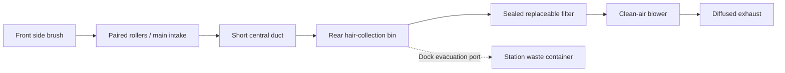

# Vacuum module: current build plan and earlier layout study

> **Scope update, 2026-09-13:** [Whole-system design](SYSTEM_DESIGN.md) now controls
> cross-module layout, carried mass, lift sizing and battery decisions. This
> earlier study remains supporting evidence; its lift deferral or battery-first
> recommendation, where present, is superseded.

## Integration pass now available

The [updated whole-robot placement](VACUUM_INTEGRATION.md),
[rotatable viewer](../design/ground/output/vacuum_integration.html) and
[power/hardware worksheet](VACUUM_POWER_AND_HARDWARE.md) implement the first
placement pass below. Reserved spaces fit within the requested outline, with
271 mm tire width and 178 mm scanner height. Wheel-pod kinematics and conditional
service paths are checked. A [Cincon converter/cooling stack](VACUUM_POWER_PACKAGING.md)
is now placed, with corrected caster swivel space and station separation. Converter
integration, final caster, brush drives, locks and finished structure remain open; this does not yet satisfy the complete purchase/print stage.

## Current plan after the cleaning-component orders

**2026-09-13 owner update:** rollers, filters and the blower kit are ordered and
awaiting delivery. Interpret these against the preceding Dreame TriCut/plain
comparison, Roborock S7/S8 filter and BIQU kit recommendations; exact purchased
variants, quantities, costs and delivered revisions have not been reported.
The two Pololu motors and RoboClaw were ordered previously; receipt has not been
confirmed. Wheel/hub purchases have not been reported.

**Next milestone: a drivable vacuum bottom attached to the development core,
with a removable head and a working sealed suction path.** Use that robot for
pickup comparisons. Flight and the older BDUAV experiment are not dependencies.
The parts orders establish a development direction; they do not establish a
completed fit or cleaning performance.

| Stage | Work | Concrete completion evidence |
|---|---|---|
| While deliveries are pending | Repack the full robot using the chosen drivetrain and published component geometry, leaving explicit reservations for unmeasured brush ends and filter seals. Design wheel mounts/support compliance, cassette receiver, bin and core trays together. | Updated top/side/3D arrangement within 275 × 275 × 180 mm; service and movement clearances listed; unresolved interfaces marked. No reuse of the earlier 178 mm result as proof of current fit. |
| In the same design pass | Complete the power/control diagram and remaining hardware list: roller and side-brush drives, local controls, logic supply, 24 V blower branch, protection, connectors, fasteners, caster and wheel/hub mounting stack. | One consolidated compatible list with quantities, costs and order/ownership status; operating/peak load budget and wiring responsibilities. Ratings and connector pinout remain open until this work is done. |
| On arrival | Identify and weigh the delivered components. Measure roller drive sockets, fixed end features, rotating clearances, filter seal/tab geometry and blower/driver connector space. | Received-part record and small unpowered fit pieces that verify those interfaces; final cassette and filter-holder dimensions. |
| First assembly | Print the verified brackets/head, then the shared chassis/core parts. Bring up logic, traction, roller and suction branches in stages. | Drive and stop predictably, keep the head/guard retained, collect debris through a sealed path, record complete empty/loaded mass. No full chassis print is released yet. |
| Cleaning comparison | Exchange the two compatible Dreame rollers where their actual interfaces permit. Use the same suction system, measured travel speed and repeated representative dog-hair loads. | Pickup, retained hair, interventions, power and maintenance results from the [cassette procedure](VACUUM_CASSETTE_PLAN.md); then check edges, 4–10 mm transitions and bin evacuation. |

The **immediate design deliverable** is the updated whole-robot arrangement and
remaining hardware list. Model the interfaces as replaceable adapters while the
parts are in transit; finalize their dimensions after receipt. Neither the
roller motor nor side-brush motor/power stage is supplied by the consumable
orders. Both RoboClaw channels are assigned to the drive wheels. The BIQU kit
includes blower electronics but does not provide the robot's battery-to-24 V
conversion, Pi supply or the rest of its power distribution.

Reserve room now for the core/bottom locators and locks, station support,
charging contacts, bin-emptying port, bump/cliff sensing and their wiring.
After the ground vacuum works, develop autonomous navigation/coverage and one
automatic charging/emptying/exchange bay. Periodic consumable servicing remains
manual; finished cleaning, docking and whole-bottom swaps remain automatic.
The second-floor station, mop and long-reach bottom follow that working common
interface. Lift sizing resumes only after the carried assemblies are designed
and weighed.

## Earlier layout study (superseded where it differs above)

**Recommendation revised, 2026-09-13:** see the
[requirements-based vacuum review](VACUUM_RECOMMENDATION_REVIEW.md) for the new
hair-priority brush investigation and washable-filter candidate. This document retains the preceding
dual-roller packaging proposal and sensitivity examples, not current fit evidence.
The [earlier component selection](VACUUM_COMPONENT_SELECTION.md) retains the
provisional BIQU blower sources. The 8 L/s example below is not a requirement.

2026-09-13 working pass, following the owner's 2026-09-12 reports. The two selected motors and dual controller are
on the way. Record these as Pololu 4846 ×2 and RoboClaw IMC404 ×1, following the
preceding selection. Received revisions, masses and actual purchase costs remain
unknown. Wheel and hub purchases have not been reported.

The owner also reports floor transitions approximately **4–10 mm high**, excluding
stairs. Use 10 mm for the next clearance study, rather than treating the house as
perfectly flat. Propulsion and the EDF experiment remain deferred.

## Work to prioritize

Develop the everyday vacuum as a complete cleaning system: roller cassette,
edge brush, bin, filter, blower and automatic-emptying interface. This determines
cleaning effectiveness, carried mass and the power budget. The owned blower and
roller fittings do not constrain the new design; their earlier geometry is a
reference, not proof of suitability or a required testing project.

The [new top-view proposal](../design/ground/output/next_vacuum_study.svg) is a
separate study from the earlier inventory-based CAD. Its
[calculation record](../design/ground/output/next_vacuum_study.json) and
[generator](../design/ground/next_vacuum_study.py) retain dimensions and assumptions.
It is not a complete 3D layout or a fabrication release.

| Arrangement in this proposal | Consequence / remaining work |
|---|---|
| 72 × 24 mm drive wheels at ±123.5 mm from the centerline | Overall tire width 271 mm; leaves 2 mm per side within the 275 mm rigid outline. Suspension motion, deflection and printed guards still need space. |
| 69 mm motor bodies behind the front head | Leaves a calculated 85 mm central gap between motor bodies. Reserve a central dirt duct here, keeping wires outside it. |
| Roller-drive motor/transmission above one cassette end | Removes the earlier 40 mm lateral drive allowance, reducing the proposed cassette width from 254.15 to 214.15 mm. Height and transmission remain unselected. |
| One side brush at the front corner | Feed debris into the main roller path. Remove the old concept's separate gated edge inlet behind the wheels. Its drawn bristle sweep and hub/motor envelopes are provisional. |
| Removable rear collection bin | Reserve 192 × 80 × 60 mm externally, or 0.922 L. Walls, caster well, ducts, seals and freeboard reduce usable capacity; retain 0.5–0.6 L only as a target. |
| Filter and clean-air blower above/rear of the bin | Preserve direct collection and an accessible filter. Their final shapes and the passive core openings must be designed together. |
| Rear caster well | Reserve a 50 × 50 mm zone for support hardware; actual wheel, swivel sweep and vertical intrusion remain to select. Deduct intrusion from bin capacity. |

The 184.15 × 28 mm roller envelope is retained only for this study. Its overall
length is not its cleaning width. Choose an exact, replaceable roller pair and
document both end interfaces before producing drive couplings. Develop removable
end shields and bearing access for dog hair, plus a compliant head mount. Keeping
the replacement cassette accessible matters as much as its initial fit.

The diagram is a functional proposal. The station needs a make-up-air path and
blower isolation during emptying; the final valves, sealing faces and hair-clear
opening are still to detail. An unrestricted bin path with service access is the
starting point; do not add a cyclone without evaluating its volume and pressure
cost against actual hair collection needs.

## Blower selection needs an operating point

Compare candidate blowers at the same airflow and total system pressure loss,
including the head, duct, bin, filter and exhaust. Include a loaded-filter case.
Neither maximum static pressure nor free-air flow specifies cleaning performance.

The table below is a **sensitivity calculation**, not a pickup requirement. It
assumes an unobstructed 184.15 × 4 mm slot, 2 kPa total pressure and 25% combined
electrical-to-air efficiency. Real roller inlets have leakage and obstructions;
actual efficiency and pressure depend on the selected hardware.

| Illustrative flow | Mean slot air speed | Air power (`pressure × flow`) | Electrical power at assumed 25% efficiency |
|---:|---:|---:|---:|
| 3 L/s | 4.07 m/s | 6 W | 24 W |
| 5 L/s | 6.79 m/s | 10 W | 40 W |
| 8 L/s | 10.86 m/s | 16 W | 64 W |

This shows why the air system should inform battery and regulator selection.
These figures exclude drive, rollers, edge brush, computing and conversion losses.
For comparison, the previously shortlisted Micronel U51DL-012KK-4 publishes
3 L/s at 2.5 kPa and 30 W at its typical working point. That is a documented
reference, not a purchase choice or an assurance of dog-hair pickup. Its stated
static speed also exceeds its continuous speed limit; retain that unresolved
restriction when comparing alternatives.
[Manufacturer data, pages 2 and 5](https://www.micronel.com/wp-content/uploads/2025/04/U51DL-012KK-4.pdf).

The next blower shortlist should include pressure/flow curves, control interface,
continuous operating limits, installed mass/envelope, noise measurement conditions
and actual distributor availability. Include filter and required electronics in
cost comparisons. The expensive Micronel example does not set the robot's price
or force selection of a medical-market blower.

## Thresholds affect the mounts

Use a floating roller cassette that can rise over transitions, and evaluate a
soft-tread caster sized for the reported thresholds. A fixed skirt a few
millimeters above the floor will need compliance or a climb profile. Suspension
travel must preserve motor, tire, head and sensor clearances in both directions.

As an illustrative sharp-step calculation, assume a 5 kg robot with 80% of its
weight on the drive pair. A 36 mm wheel radius at a 10 mm step gives approximately
**0.488 N·m per wheel** from `T = wheel_load × sqrt(2*r*h − h*h)`.
This is above Pololu's 0.392 N·m continuous gearbox guidance but below its
0.785 N·m intermittent guidance. It is a brief-load case to design for, not a
continuous torque target or a demonstrated climb. Actual load transfer, caster
climb, traction, motor current and the length of the event remain to check.
[Motor load guidance](https://www.pololu.com/product/4846).

## Other work that can proceed independently

- **Core/module joint:** define the locating features, retained mechanical latch,
  station support and isolated power/data connector as one interface. Start with
  a small mating sample once geometry is complete; whole-bottom exchange remains
  automatic in the finished design.
- **Navigation and floor protection:** use the Pi and RPLIDAR as starting hardware;
  plan bump, downward cliff and near-floor obstacle sensing alongside them.
  Floor sensors need placement and stopping-distance requirements before SKU
  selection. The planar scanner alone does not observe the entire floor surface.
- **Power architecture:** build operating/peak load budgets and separate logic,
  traction and tool branches. Choose final battery, regulators, protection and
  dock charging together after the blower and cleaning drives are sized.

The roller/filter choice and blower comparison are now documented in the linked
selection pass. Dimensioned wheel cartridges, powered cassette geometry and full
air-system integration remain next. Produce consolidated hardware lists for
complete subassemblies before further purchases. The threshold question is resolved.
