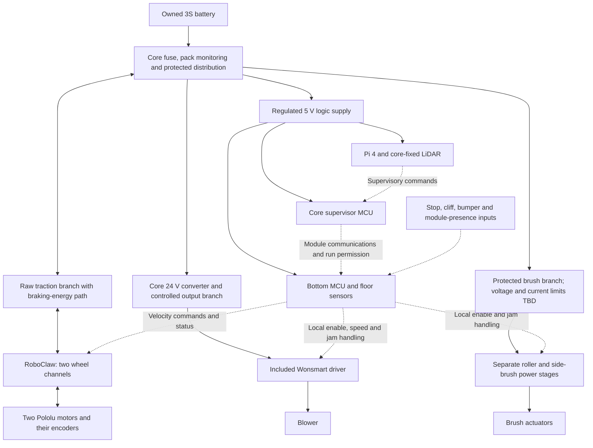

# Vacuum power and remaining hardware

> **Scope update, 2026-09-13:** [Whole-system design](SYSTEM_DESIGN.md) now controls
> cross-module layout, carried mass, lift sizing and battery decisions. This
> earlier study remains supporting evidence; its lift deferral or battery-first
> recommendation, where present, is superseded.

2026-09-13. Functional design for the first core plus everyday vacuum bottom.
The [consolidated hardware worksheet](../config/vacuum_build_hardware.csv) covers
owned items, orders, candidates and unresolved assemblies together. Blank prices
mean unknown, not free. This is **not yet a complete compatible purchase release**:
converter integration, brush drives, caster and mechanical retention still determine several
parts and their ratings. There is no additional test-harness purchase in this plan.

## Power architecture

The present CAD and diagram retain the owned 3S battery as a comparison baseline.
The owner has supplied [specific 6S and 8S alternatives](VACUUM_POWER_PACKAGING.md#exact-6s-and-8s-candidates-supplied-by-the-owner);
6S is preferred for the next power/packaging review, with neither pack purchased
or confirmed to fit. The converter requirement below is the retained 3S study,
not a finalized purchase. Higher voltage requires reconsidering the 12 V motors,
braking energy, blower regulation and charging system. Automatic charging remains a separate designed subsystem;
the existing hobby charger is a development tool, not an unattended dock charger.

The diagram shows functions, **not connector pin numbers or a ready-to-wire
schematic**. Module power contacts need controlled sequencing, ground-first
mating, an identification/presence signal and de-energized separation. Do not
assign an ordinary manually mated plug as the finished automatic connector.
Reserve space for both mating halves and cable bends; the bay boxes alone do
not prove their fit.

RoboClaw owns the two wheel speed loops and encoder inputs. Its published 5 V
BEC is only 800 mA, so the Pi gets a separate supply. The controller supports
regeneration and configurable current/voltage behavior; its available current
is not a safe motor-current setting. Keep the braking-energy path accounted for
when stopping or disconnecting the battery. A full battery or an opened pack
protection switch cannot be assumed to absorb returned energy.
[Basicmicro controller specifications](https://www.basicmicro.com/RoboClaw-2x7A-Motor-Controller_p_55.html).

The bottom MCU handles short control deadlines, stop inputs, roller jams and
blower permission locally. The core supervisor manages module presence and
power sequencing. ESP32-DevKitC V4 remains a candidate for each; a final I/O map
and mounting check are required. CAN is a proposed module link, requiring two
transceivers for the core and this bottom, plus termination. The Pi's higher-level
planner does not directly control emergency stopping.

The Wonsmart driver is included in the BIQU order; no extra blower ESC is needed.
Its EN input runs when floating and stops when grounded, so the robot needs a
hardware default-off arrangement that remains off during MCU reset or cable
failure. The included printer adapter is optional after its interface is checked;
its purchase inclusion is not a reason to install it. Driver ratings are 3 A
continuous and 6 A peak, which do not establish blower startup current.
[BIQU documentation](https://global.bttwiki.com/Universal%20Turbo%20Kit.html).

## Supply sizing and candidates

| Branch | Design basis | What remains to close |
|---|---|---|
| Logic | Allocate 25 W at regulated 5 V for Pi 4, A1 and local control | Actual peripheral loads, regulator derating, cable drop and cooling |
| Blower | Allocate 80 W supply capacity at 24 V; keep actual driver load within its own rating | Converter low-input performance, startup, enable circuitry and thermal design |
| Wheels | Two 12 V motors; published 0.30 A no-load and 5 A extrapolated stall **per motor** | Set limited operating current from motor/gearbox load and heating; stall is not an operating point |
| Main roller and side brush | Unselected motors and power stages | Torque, RPM, stall/jam limits and electrical budget after matching the mechanism |
| Station locks and docking | Not included in first rolling vacuum load estimate | Actuators, duty cycle, charging and connector design |

The wheel figures come from the [Pololu 4846 specification](https://www.pololu.com/product/4846/specs).
At an **illustrative 82% blower-converter efficiency**, the 80 W allocation draws
8.8 A at 11.1 V, or 10.2 A at 9.6 V. Logic at its full 25 W allocation adds 2.9 A
at 9.6 V with a separate assumed 90% efficiency. The 9.6 V case is a sizing
example, not a selected LiPo cutoff. That is already about 13.1 A before traction
and brushes. The fan is included in the logic allocation, not added twice.
Do not pick a main fuse from blower current alone. Branch fuses must protect the
actual conductors/connectors, with startup and time-current behavior considered.

The pack's nominal energy is `11.1 × 5.2 = 57.7 Wh`. Using an assumed 80% gives
46.2 Wh. Runtime is that energy divided by measured average **battery-side**
power; no runtime or area coverage is promised until the robot's full load is
known. Capacity, voltage sag, cutoff and conversion losses must not be counted
as measured merely because the pack is labeled 5200 mAh.

| Candidate / screen | Evidence and procurement snapshot | Decision in this pass |
|---|---|---|
| Pololu **D36V50F5 / 4091** logic regulator | 25.4 × 25.4 × 9.5 mm; 5 V, input 5.5–50 V; current is thermally dependent. $39.95, rationed/backorders listed on 2026-09-13. [Manufacturer](https://www.pololu.com/product/4091) | Fits the core power allocation as a bare board. Candidate only: confirm 3S load curve, loaded voltage/cable drop, cooling and source availability. The headline 5.5 A is specified at 36 V input. |
| Cincon **CHB100W-24S24** | 9–36 V to 24 V / 4.17 A; 100 W nominal, 95 g bare. [DigiKey 2034-3000-ND](https://www.digikey.com/en/products/detail/cincon-electronics-co-ltd/CHB100W-24S24/9684253), $104.30 observed. | **Working baseline.** Enlarged 70 × 70 × 50 mm bay includes nominal cooling stack. [Carrier, cooling and startup requirements](VACUUM_POWER_PACKAGING.md) remain open; not a purchase release. |
| DFRobot **FIT0172** boost | 8–18 V input, 24 V output; 74 × 74 × 32 mm, 280 g, $45; published efficiency 82–88%. [Manufacturer](https://www.dfrobot.com/product-586.html) | Does **not** fit the revised 70 × 70 × 50 mm bay, even before leads. Its maximum 240 W claim applies at ≥12 V input. Repacking is possible but this is not a selected onboard solution. |
| Fidus **FED100-24S24W** | Published 9–36 V input, 24 V/4.2 A, 50.8 × 25.4 × 16.3 mm bare module. [Manufacturer family/specification](https://fiduspower.com/fed100w.html) | Dimensional lead only. Carrier, low-input derating, cooling, transient behavior, price and distributor availability remain unresolved. Not a purchase recommendation. |
| Pololu **U3V70** family | Fixed outputs through 15 V; adjustable through 20 V. [Manufacturer family](https://www.pololu.com/category/243/u3v70x-step-up-voltage-regulators) | Reject for the 24 V branch. Do not infer a 24 V version from other Pololu boost families. |

The Cincon baseline now has a nominal carrier/thermal stack in the integration
model. The [packaging decision](VACUUM_POWER_PACKAGING.md) records sources, thermal
estimates, mass additions and remaining electrical work. A clear box model does
not establish an 80 W installed rating; low-input startup and cooling still need
qualification.

## Remaining hardware, grouped for procurement

The CSV is the working list. Its quantities describe one core plus one vacuum
bottom, with spare comparison consumables explicitly separate. Hardware counts
for custom assemblies are planning quantities; final lengths/ratings depend on
the mounting and circuit drawings.

- **Traction:** two wheels and two hubs if not already ordered; eight wheel-to-hub
  screws; motor mounting screws; two pod pivots, bushings, springs and stops;
  one selected soft-tread swivel caster and its mounting hardware.
- **Cleaning:** mechanism-matched main and side-brush drive assemblies, their two
  power stages, head supports/retention, shaft/end shields, flexible duct,
  gaskets, filter adapter, bin lid and evacuation gate. The roller orders contain
  consumables, not these drive assemblies.
- **Power/control:** logic and blower converters, two local MCU boards, module
  communications hardware, pack monitor, branch protection, stop circuitry,
  blower enable interface, connectors and harness. Account for braking energy.
- **Mechanical:** frame/tray fasteners and inserts, motor load spreaders if
  required, battery restraint, strain relief, bumper and floor-sensor mounts.
- **Later automatic station:** capture/release actuation, lift/transfer mechanism,
  charging contacts and charger, bin-evacuation coupling and station waste system.
  These remain project requirements and are not included in a false first-build total.

Do not sum the existing mass ledger and this hardware worksheet: the former
tracks assembly mass, while this one breaks down purchasing needs. The wattmeter
and scale remain external measurement tools, not assumed carried equipment.
Next purchase release should bundle the unresolved items after converter,
caster, brush and joint choices are closed.
